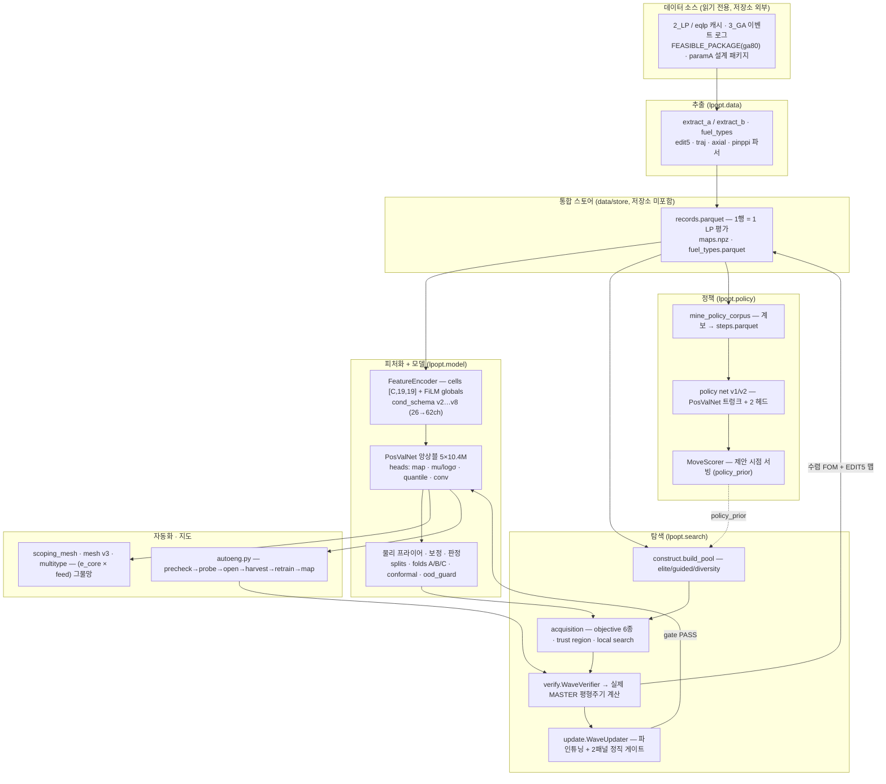

# lpopt — 평형주기 노심 장전모형을 스스로 설계하는 노심 엔지니어 AI

**집합체 연소 특성**(k-inf(BU) 곡선 형상, HGC 2군 단면적·ADF·pin form function, 연소도 배치)과
**평형주기 주요 결과 인자**(`cyclen`, `CBC_max`, `F_r`, `F_q`, `node_peak`/`map_cov`,
집합체·핀 연소도)를 분석하여, **최적의 평형주기 노심 장전모형(loading pattern, LP)을 찾는 규칙
자체를 학습**한 노심 엔지니어 AI다. 대상 노심은 **APR1400 17×17**(241 집합체, 1/4 대칭 69 슬롯),
라벨은 결정론적 노심해석 코드 **MASTER**의 평형주기 수렴 결과이며, 개발 기간은
**2026-07-16 ~ 2026-08-31**이다. 저장소는 **2026-08-31 스냅샷**이다.

> **2026-08-29 목적축 전환.** 최적화 목적은 `F_r`(방사방향 첨두)에서 **`F_xy`**(MASTER `FXYP`,
> 핀 평면 첨두, 한계 **1.65**)로 바뀌었다 — 사용자 확정 "목적 = **min(max F_xy)**, `F_r`은 제약".
> 두 축은 실제 노심에서 순서가 바뀌므로(§2.3) 어느 쪽도 다른 쪽을 함의하지 않는다.
> 2026-08-30, 프로그램은 **모든 인허가 축이 실측되고 전부 한계 안인 첫 노심**을 산출했다.

`lpopt`은 "서로게이트 예측기"가 아니라 **노심 엔지니어의 작업 루프 전체**를 코드로 옮긴 시스템이다.
기존 MASTER 결과를 통합 스토어로 수확하고, 물리 기반 피처로 인코딩해 위치-가치 CNN 앙상블
(PosValNet)을 학습시키고, 그 앙상블로 후보 LP를 선별해 캠페인당 100회의 **실제 MASTER 계산**으로
검증하고, 검증 라벨을 스토어에 되먹여 재학습-게이트-탐색 루프를 돈다. 그렇게 쌓인 캠페인 계보에서
**개선-스텝**을 채굴해 무브-제안 정책망을 학습시키고, 전 과정을 셀 단위로 무인 실행하는
**자동 엔지니어(autoeng)**와 설계공간 지도(**그물망, mesh**)로 이어진다.

---

## 1. 북극성과 단계 진화

> **북극성**(사용자 확언, 2026-07-29): *"궁극적으로는 예측을 넘어서 최적의 노심을 장전하는 규칙
> 자체를 학습하고 최적의 노심을 결과물로 내놓는 것."* — 정확도(ρ, MAE)는 목표가 아니라 **탐색이
> 소비하는 능력**이다.

| 단계 | 무엇을 학습/산출하는가 | 상태 |
|---|---|---|
| ① **예측 (surrogate)** | PosValNet 앙상블이 LP → 8 스칼라 타깃 + 4채널 노드맵을 예측 | 운영 (10세대 챔피언) |
| ② **모델-유도 탐색** | `lpopt optimize` — 능동탐색 + MASTER 웨이브 검증 + 온라인 게이트 | 운영 (프런티어 기록 보유) |
| ③ **규칙 추출** | 계보 71,517행에서 장전 규칙 `loading_rules_v1` 채굴 → 적대적 재검증 → acid test | 24규칙 확정 / 단독 구성기는 FAILURE |
| ④ **정책 모델** | 개선-스텝 코퍼스 → 무브-제안 정책망 (policy v1 → v2) | v1 낙제 / v2 게이트 1/2절 |
| ⑤ **자동 엔지니어 + 그물망** | `autoeng.py` 셀 상태기계 · `(e_core × feed)` 설계공간 지도 | autoeng 구현·테스트 완료(미발사) / 그물망 최우선 진행 |
| ⑤′ **안전 실드 + 납품 판정** | OOD/conformal을 순위·풀·납품에 연결(`ood_policy`, `conformal_gate`), `is_feasible_search`/`is_deliverable` 분리 | 구현 완료(기본값은 기존 동작) / **첫 deliverable 노심 산출** |
| ⑥ **향후** | 노심-크기 불변 v3(OPR1000·i-SMR), 축방향(블랭킷·컷백), 전이주기(cy1→평형) | 설계서·계획서만, 착수 보류 |

⑥의 세 축은 **문서화되어 있으나 코드로 착수되지 않았다.** 이 저장소에서 실행 가능한 것은 ①–⑤다.

---

## 2. 핵심 성과 (숫자와 날짜)

### 2.1 데이터와 모델

| 항목 | 값 | 일자 |
|---|---|---|
| 통합 스토어 | **76,693행** (`f_xy` 라벨 **7,667** · `max_pin_burnup` **40,870**) | 2026-08-31 실측 |
| (직전 스냅샷) | 73,903행 canonical → 74,657 → 74,717 → 75,793 → 75,893 | 08-16 / 08-29 / 08-30 |
| 코퍼스 기점 | 기존 자산 ~43,000행 (2_LP MASTER 캐시 **38,854** + 3_GA **~4k**) | 2026-07-16 |
| 개선-스텝 코퍼스 | 방출 스텝쌍 **28,889**(개입 웨이브 r1 순증 **+792** = +800 − 격리 160 + 재실행 152, `F_xy` 열 추가로 **85열**) | 2026-08-31 |
| 챔피언 계보 | **11세대**(`20260729_054749`를 1대로 세는 프로그램 관례 — 승격 전수 15회), 최종 **`s1j`** (cond_schema **v8**, 62ch/20g, **`f_xy` 직접 헤드**, `f_xy` σ는 **서빙 금지**) | 2026-08-30 |
| 앙상블 | **5멤버 × 10.4M 파라미터** (width 224 / n_blocks 8 / head_hidden 384) — 2026-07-25 이후 동결 | — |
| 테스트 | **104 파일 / 2,135 테스트 함수** (torch 없이 동작하는 M0 스위트 포함) | 2026-08-31 |

**고정 평가면 정확도** (`groups.ab2_frozen_val_by_cell`, 3,207행 / 36셀 / iso군 118개, 7세대 전부 오염 0행):

| 세대 | F_r ρ | F_r MAE | node_peak ρ | cyclen ρ | cyclen MAE |
|---|---:|---:|---:|---:|---:|
| `20260729_054749` (v6) | 0.9250 | 0.1222 | 0.9141 | 0.7667 | 3.982 EFPD |
| `20260810_bu_T` (v6b) | **0.9500** | **0.0974** | 0.9384 | **0.8981** | **2.742 EFPD** |
| `s1f` (v6b, 운영 기준) | 0.9449 | 0.1078 | 0.9340 | 0.8854 | 2.872 EFPD |

> **정직한 한 줄**: 잡음 바닥(단일시드 ρ_F_r sd ≈ 0.018)을 넘는 **일반 정확도** 개선은
> 1세대 → 2세대(연소도 배치 수정, v6b) **단 한 번**이다. 이후 세대가 산 것은 **셀 특이적 탐색
> 성능**(§2.2)과 **표현 능력**(v7/v8의 3~5종 신연료 스코어링)이다.

### 2.2 프런티어 기록

**`F_xy` 축 (2026-08-29 이후의 목적축, 한계 1.65)**

| 축 | 기록 | 조건 |
|---|---|---|
| `F_xy` 최저 · **납품 가능** | **1.5322** (`bf3a70b2`) | `min_fxy` T6_T4/f121 r1 wave 7. `F_r` 1.4857 · cyclen 622.1 EFPD · CBC 1337 ppm · `F_q` 1.853 · \|AO\| 0.024 · **핀 63.76 실측** → 전 축 측정·한계 내 (2026-08-30) |
| `F_r` 기록 코어의 `F_xy` | **1.5402** (`4d70ab6f`) | 08-15 `F_r` 단독 기록(1.4605)을 `F_xy`로 실측한 값 — r1 이득은 **0.008(−0.5%)에 불과** |
| `F_xy` 시대 생산 R1 최저 | 1.6926 | 19 strata × 40, 1,076체인. **1.65 이하 발견 0** — `F_xy`가 바인딩 제약임을 확정 |
| 스토어 `deliverable` 행 | **25행** (전부 T6_T4/f121) | 핀 62.5–63.8 실측, `is_deliverable` TRUE (2026-08-30) |

**`F_r` 축 (2026-08-29 이전의 목적축, 한계 1.55) — 기록은 유지되되 헤드라인이 아니다**

| 축 | 기록 | 조건 |
|---|---|---|
| `F_r` 단독 | **1.4605 @ 618.0 EFPD** | 밴드 **밖**, `batch_swap` 계보 (2026-08-15). `F_xy` = 1.5402 |
| `F_r` 밴드내 λ-최적 | **1.4749 @ 625.46 EFPD** | `minfr_lambda = 400`, CBC 1355.8 / F_q 1.8233 (r8) |
| 기존 기준(ga80) | 1.4636 @ 633.3 EFPD | 밴드내 미돌파 |
| 평탄도 `node_peak` | **1.284 → 1.2285 → 1.2085 → 1.1932 → 1.1899** | fpcamp4, 2026-08-10 (포화 조짐) |
| 서브-1.55 실측 | **전 6밴드 달성** (최저 `E1_E2/f125` **1.5085**) | `fr_boundary` 생산 캠페인, 2026-07-23~24 |
| 3종 계단화 라운드 2 | **NULL 발화** (클린 최저 1.5999) | CBC 벽에 막힘 → **3종 `F_r`-only 라인 폐쇄** (2026-08-29) |

**M5 파일럿 vs GA** (`runs/20260717_073757`, 2026-07-17): 100콜로 신규 feasible 2개,
best **F_r 1.544 / cyclen 652.6**. GA-600 대비 목적함수 **−27.61 vs −28.29** 우위,
first-feasible **12콜 vs 356콜**.

> **한 줄.** `F_r` 기록 코어를 `F_xy`로 재측정해 보니 1.5402였다 — 즉 **7개월치 `F_r` 최적화가
> 새 목적축에서 산 것은 0.008이다.** 축이 바뀌면 기록도 다시 매겨야 한다는 것이 이 전환의
> 첫 교훈이다.

### 2.3 발견된 물리 (개입 실험으로 확정)

- **누설-중재 (leakage arbitration) — 부호 SETTLED · 크기 cell-conditional.** *fresh 외곽 배치 =
  평탄화 이득 + cyclen 지불.* 인용 기준은 개입 웨이브 r1 **Amendment 2**(2026-08-31, HGD569
  오염 정정 후)다: pooled `fresh_relocate` Δcyclen **−1.1649 EFPD** [−1.511, −0.836]
  (부호 62/195, p = 4.0e-7). 부호는 **5/5 셀**에서 성립하나 셀별 유의는 **3/5**뿐이다.
  08-15 어블레이션의 크기 **−1.74 EFPD**(도즈 −8.37 EFPD/unit)는 같은 셀 재현이
  −0.5171 [−1.020, −0.037]로 **CI 비중첩 → 3.37배 과대추정으로 철회**됐다(부호만 유지).
  같은 개입에서 F_r mean(out−in) **−0.404**, node_peak **−0.357**. **관측 코퍼스는 부호를
  거꾸로 읽었다**(`d_fresh_share_periph` vs `d_cyclen` = +0.093 → 개입에서는 −0.635).
- **`batch_swap` 분지 특이성.** 618 EFPD 분지 개선률 **0.052**(11/213) vs 625 분지 **0.005**(1/218),
  Fisher exact **p = 0.0028**. 연산자 일반화 권고는 **철회**되고 "branch-dependent, 사전예측 불가"로
  약화. 부수 규칙: **λ-목적 검사는 모든 프런티어 판독에 의무**(F_r 단독 헤드라인이 2회 연속 뒤집혔다).
- **다종 계단화는 R1 경계에서 정확히 갈린다.** 90셀 스윕에서 **R1 mono-spec 3종은 10/10 전부 이득**
  (평균 ΔF_r **−0.0378**), **R1 cross-spec 3종은 19/19 전부 손해**(평균 **+0.0749**) — 부호가 한 셀도
  섞이지 않는다. 인허가 제약으로 쓰인 R1(급전 집합체 간 농축 사양 혼합 금지)의 경계와 일치.
- **`F_xy`는 `F_r`의 상수배가 아니다 — 전달계수가 무브 클래스에 의존한다.** 스토어 전역
  비율은 `F_xy/F_r = 1.069 ± 0.018`이고 한계도 `F_xy ≤ 1.65 ≈ F_r ≤ 1.55`로 대응되지만,
  **순서가 바뀐다**(E1E2/f109에서 `F_r` 통과 52개 중 **18개가 `F_xy` 실패**). 개입 웨이브 r1의
  H3는 그 이유를 짚었다 — 전달계수가 **농축·반경 무브에서 1.23–1.42, Gd·격자 무브에서
  0.55–0.73**으로 갈린다. **비율 프록시는 Gd 무브에 부적격**이고, 이것이 헤드가 필요한 이유다.
- **Gd/격자 기술자 결손(H4).** `d_fresh_enr_r_center ≡ 0`인 무브가 `F_xy`를 **+0.07** 움직인다 —
  현 기술자 집합은 Gd·격자 축의 자유도를 담지 못한다. (2026-08-30, 개입 r1)
- **`F_xy`는 완전 결정론적이다.** 재시작 독립성 웨이브 40/40에서 `|ΔF_xy| = 0.0000` —
  마진에 잡음 여유를 둘 필요가 없다(2026-08-30). `F_r`·cyclen과 같은 등급의 재현성.
- **핀연소도는 결박축이다.** 한계 **80 GWd/tU**(관측량 = 핀 axial peak). 44체인 실측 웨이브에서
  `N1N2/f113` **0/5**, `E1E2/f109` **0/5** PASS — **F_r로는 열렸으나 납품 불가**.
  `HGD569/f125` 2종·3종은 5/5 PASS(75.47 → 74.38, 계단화 핀 이득 실측 재현).

### 2.4 판정된 한계 (같은 비중으로 기록)

| 축 | 수용 기준 | 현재 | 배율 |
|---|---|---|---|
| `cyclen` | ≤ 1 EFPD | 0.74 | **통과** |
| `CBC_max` | ≤ 1 ppm | 15.7 ppm | 16× |
| `node_peak` | ~1e-3 | 0.021 | 20× |

장전 규칙집 v1은 **단독 구성기로는 FAILURE**(acid test minfr 1.5771 vs 기준 1.479)이고,
정책 v1은 현행 시대에서 **parent-blocked AUC 0.492 = 우연 수준**이며, 정책 v2는 게이트
**1/2절 FAIL**(단 regret@8 **0.00366** vs v1 0.0193으로 배치 권고바는 PASS)이다.
모델 용량 스케일링·앙상블 확대·손실 공학은 전부 **DEAD**로 판정되었다(10.4M 무릎점).

**`F_xy` 헤드의 정직한 위치 (2026-08-30).** `s1j`의 `f_xy` 직접 헤드는 사전등록 바
(MAE < 0.0767 · ρ̄ > 0.7263, 서빙경로 프록시 야드스틱)를 **MAE 0.0663 / ρ̄ 0.790**으로
통과해 승격됐다. 그러나 **σ는 서빙 금지**(커버리지 0.83, 명목 미달)이고, `min_fxy` r1
캠페인의 셀 안에서는 **모델-프리 비율 추정기(MAE 0.008)가 헤드(0.04–0.06)보다 5~7배
정확**했으며 헤드의 셀내 ρ는 **−0.11**이었다. 즉 헤드가 산 것은 **셀 간 레벨**이고,
셀 내부 순위는 아직 프록시가 이긴다.

### 2.5 외부 기술 검토 등급 (2026-08-29, 커밋 `45ed8b35`)

독립 검토자가 공개 저장소를 정적 감사한 [`RL_core_loading_engineer_AI_review_2026-08-29.md`]의
종합 등급이다. **낮은 점수를 감추지 않고 그대로 싣는다** — 이 프로그램의 08-29~31 작업은
대부분 이 표의 P0 항목에 대한 응답이다.

| 평가 항목 | 판정 |
|---|---:|
| 요청한 연구 **방향성 적합도** | **A− / 약 86점** |
| 현재의 **AI 장전모형 탐색기 성숙도** | **B / 약 68점** |
| **실제 노심 엔지니어 대체 준비도** | **C− / 약 40점** |
| **강화학습 시스템으로서의 완성도** | **D+ / 약 35점** |
| 공개 저장소의 **재현성** | **C− / 약 38점** |

검토자의 명칭 권고는 *"Physics-verified autonomous loading-pattern optimization platform
(물리 검증형 자율 장전모형 탐색 플랫폼)"* 이며, "RL"·"엔지니어 대체"는 ① v2 이상 정책의
후보생성기 연결 ② 고정 MASTER 예산에서 정책 off 대비 유의 향상 ③ 다단계 episode·장기보상
검증 ④ autoeng 실전 캠페인 성공 ⑤ fail-closed safety shield + 독립 V&V **이후에** 쓰라는
조건부다. 8개 능력 정의 대비 격차표는
[`docs/03_search_policy_autoeng.md`](docs/03_search_policy_autoeng.md) §10에 있다.

**P0 지적과 08-29~31의 응답:**

| ID | 지적 | 상태 (2026-08-31) |
|---|---|---|
| P0-01 | policy v2가 탐색 서빙에 미연결 | **부분** — `MoveScorerV2` + `policy_prior ∈ off\|fr\|flat\|both\|v1\|v2\|shadow_v2` 배선·A/B 사전등록 초안까지. **발사 전** |
| P0-02 | safety envelope가 주 acquisition에 미통합 | **부분** — `f_xy`를 목적이자 경성 한계로 편입, `is_feasible_search`/`is_deliverable` 분리 |
| P0-03 | 결측 핀BU를 feasibility PASS 처리 | **해소(납품 경로)** — `is_deliverable`은 미측정 축을 거부, `unknown_axes`가 무엇이 없는지 이름을 댄다 |
| P0-04 | OOD·conformal이 경고 전용 | **해소(옵션)** — `ood_policy = warn\|escalate\|reject`, `conformal_gate`가 `U_c(x) ≤ L_c` 경성 스크린. **기본값은 기존 동작** |
| P0-05 | autoeng 실전 미발사 | **미해소** |
| P0-06 | 독립 V&V 부재 | **미해소** |

---

## 3. 시스템 아키텍처



**닫힌 루프의 두 원칙**
1. **모든 승격은 게이트를 통과한다.** 웨이브 내부 게이트(`search/update.py`)와 챔피언 교체
   게이트(`lpopt gate-promote`)가 있고, 후자는 **양쪽 모델을 동일 홀드아웃 행에 라이브 채점**해
   챔피언 in-sample vs 후보 out-of-sample의 불공정 비교를 구조적으로 금지한다.
2. **검증 라벨은 곧바로 학습 데이터가 된다.** `harvest_maps = true` 덱은 수렴한 EDIT5 맵까지
   수확하므로 맵 헤드도 캠페인이 실제로 밟은 영역에서 학습된다.

### 3.1 저장소 디렉터리 맵

```
RL/
├─ lpopt/                    # 패키지 (콘솔 스크립트 `lpopt`, `python -m lpopt`)
│  ├─ cli.py config.py       # argparse CLI · TOML `.inp` 덱 → dataclass (알 수 없는 키 = 하드 에러)
│  ├─ safelog.py            # 인코딩-안전 로깅 (cp949 로그 한 줄이 완주한 캠페인을 침몰시킨 사고의 교정)
│  ├─ curriculum.py          # 셀 순차 커리큘럼 드라이버 (36셀 상태기계)
│  ├─ multi_pc.py remote.py  # 다중 PC 생산 키트 · SSH 원격 GPU 학습
│  ├─ data/                  # 추출·스키마·스토어·라벨 정의 (fuel_types, edit5, flatness, pinppi, fxy …)
│  ├─ model/                 # PosValNet · 학습 · 보정 · 스플릿/폴드 · A/B 판정 하네스
│  ├─ search/                # genome · construct · acquisition · verify · campaign · rule_metrics
│  ├─ policy/                # 무브-제안 정책망 v1/v2 + MoveScorer
│  ├─ design/                # 파라메트릭 연료설계 생산 체인 (DeCART → TotalBatcher → MASTER)
│  ├─ report/ tools/         # 캠페인 리포트·figure · 멱등 마이그레이션/감사 도구
│  │                        #   backfill_fxy(MAS_OUT 소급 라벨) · quarantine_campaign(결함 캠페인 격리)
│  │                        #   repair_parent_ids(계보 외래키 수리)
│  └─ vendor/masterrl/       # 바이트 고정 `master_rl` 스냅샷 (VENDOR_MANIFEST.json으로 재해시)
├─ tests/                    # 104 파일 / 2,135 테스트 함수
├─ docs/                     # README.md 색인 + 01~06 본문 + reference/
├─ data/reports/             # 사전등록·판정 리포트와 표 (최상위 281개 항목 · 마크다운 114편,
│                            #   하위 디렉터리 5개 포함 시 428 파일 · 마크다운 123편)
├─ data/reference/           # KNGR cy1–cy8 다주기 참조자산
├─ data/design/              # 개입 웨이브 r1 계획 매니페스트(intervention_wave_r1.json)
│  └─ package/               # paramA 설계 패키지 매니페스트 (designs.json · registry.json만 포함)
├─ data/models/s1j/          # 챔피언 메타데이터만 (ensemble.json · PROMOTION.md — 체크포인트는 미포함)
├─ data/README.md            # `data/` 레이아웃·스키마 안내 (대용량 산출물은 버전관리 제외)
├─ config/                   # fuel_types 수동/추출 YAML · user_criteria 참조 덱
├─ dbx/                      # feasible_database 방어적 파서 + 보정 LRM 백본
├─ opmodel/                  # 운전점 모델 s01…s23 (k(BU) 곡선만으로 cyclen·CBC 예측)
├─ templates_lat1600/        # 저-FF 격자 설계 템플릿 (260624 / 5.8_5.1)
├─ autoeng.py autoeng.toml   # 자동 엔지니어 + 설정
├─ scoping_mesh.py mesh_*.py lrm_mesh.py mesh_vs_db.py   # 그물망 프로그램
├─ mine_policy_corpus.py mine_sa_lineage.py train_policy_v*.py   # 정책 학습
├─ ablation_wave.py batchswap*_wave.py fr_arms.py v520_*.py …    # 사전등록 실험 (arm/wave)
├─ intervention_wave.py readout_axis.py                          # 개입 웨이브(Campaign A) · 목적축 인식 프런티어 판독
├─ rule_construct.py rule_acid_run.py                            # 규칙 단독 구성기 + acid test
├─ pyproject.toml .gitignore # 패키징(콘솔 스크립트·pytest testpaths) · 대용량 제외 규칙
├─ *.inp                     # 캠페인·생산 덱 (lpopt.inp = 기준 덱)
└─ launch_*.ps1 run_*.bat status_*.ps1   # 생산 PC 발사·감시 3종 세트 (+ run_mesh_*.sh = GPU 박스용)
```

**대용량 데이터는 포함되지 않는다.** `.gitignore`가 명시적으로 제외하는 것:
`runs/`, `data/models/`(체크포인트), `data/store/`(records/maps/fuel_types parquet),
`data/splits/`, `data/campaigns/`, `data/curriculum/`, `data/policy/`(steps parquet),
`data/produce/`, `data/autoeng/`, `data/design/package/`(designs.json·registry.json만 예외),
`data/models/`(챔피언 `s1j`의 `ensemble.json`·`PROMOTION.md`만 예외),
그리고 전역 패턴 `*.npz` / `*.pt` / `*.parquet`(`opmodel/*.npz`와 `tests/data/*.parquet`만 예외).
용량 때문에 제외된 개별 리포트 아티팩트 8건(CSV 7 + xlsx 1)은 [`docs/reference/EXCLUDED_LARGE_FILES.txt`](docs/reference/EXCLUDED_LARGE_FILES.txt)에 파일명·바이트로 열거되어 있다.

---

## 4. 문서 가이드

| 문서 | 내용 |
|---|---|
| [`docs/01_architecture.md`](docs/01_architecture.md) | 시스템 구조 — 패키지 모듈 전수, CLI 서브커맨드 표, TOML 덱 스키마, 최상위 스크립트 계층, 벤더 스냅샷 |
| [`docs/02_model_methodology.md`](docs/02_model_methodology.md) | 모델 방법론 — 집합체 표현, cond_schema 진화, PosValNet 구조·손실·물리 프라이어, 스플릿·정직 게이트, 정확도와 한계, **`F_xy` 헤드 arm 1–3과 서빙경로 결함**, 챔피언 계보(승격 15회 = 프로그램 11세대) |
| [`docs/03_search_policy_autoeng.md`](docs/03_search_policy_autoeng.md) | 탐색 캠페인 루프, 프런티어 궤적, 학습된 규칙의 소비 방식, **`min_fxy` 목적·안전 실드·납품 판정**, 정책 v1/v2 판정과 v2 서빙, 개입 웨이브, 자동 엔지니어, 그물망, 확장 축, **외부 검토 격차표** |
| [`docs/04_timeline_and_results.md`](docs/04_timeline_and_results.md) | 개발 타임라인과 결과 — 라운드별 사건·판정·수치의 시계열 (2026-07-16 ~ 08-31, 사고 기록 포함) |
| [`docs/05_report_index.md`](docs/05_report_index.md) | 리포트 색인 — `data/reports/`의 사전등록·판정 문서 목록과 주제별 진입점 |
| [`docs/06_learned_loading_rules.md`](docs/06_learned_loading_rules.md) | **학습된 장전 규칙** — 결과 인자 사전, 규칙 24종(G/R/F군), DEAD 목록, 규칙 간 상충, 코드 구현 |
| [`docs/reference/PWR_commercial_core_loading_pattern_engineering_rules_KO.md`](docs/reference/PWR_commercial_core_loading_pattern_engineering_rules_KO.md) | **공개자료 기반 상용 PWR 장전 규칙 종합 보고서** — §3 "채택/미채택" 판단의 원본 지식베이스 |
| [`docs/reference/EXCLUDED_LARGE_FILES.txt`](docs/reference/EXCLUDED_LARGE_FILES.txt) | 용량으로 제외된 리포트 아티팩트 목록 |

모든 문서가 **정직성 규약**을 따른다 — 수치는 저장소 내 실측 리포트에서 인용하고 **측정 일자를
병기**하며, 근거 문서가 없는 서술은 `(추정)`으로 표시하고, **실패한 실험과 기각된 가설도 성공과
같은 비중으로** 기록한다.

---

## 5. 방법론 요약

- **FA 표현 = 물리 출력 벡터.** 집합체는 격자 핀맵이나 identity 임베딩이 아니라 **결과값**으로
  표현한다: `k-inf(BU)` 곡선 형상 **9채널**(reactivity swing, peak, dip, 소진 기울기 …),
  HGC 유래 2군 단면적·ADF·pin form function 최대치, 그리고 `(library, feed)`별 실측
  **연소도 배치**(v6b). **독봉 불가지론** — Gd 특정 축(n_gd, gd_wt)은 학습 채널에서 제외하고
  곡선 형상이 보편 독봉 서명을 담당한다(미래 IFBA/Er/Dy 대응). 널테스트 결과 (k곡선 + 농축도)는
  충분통계가 **아니며**, 두 번째 특성은 ADF로 판별되었다.
- **PosValNet 앙상블 5 × 10.4M.** 입력 `cells [B,C,19,19]` + FiLM 조건 벡터, 출력은 슬롯별
  EDIT5 4채널 맵 헤드 + 타깃별 `mu`/`log σ` + convergence 로짓(선택 헤드: quantile, axial,
  traj, 물리 프라이어 잔차). 아키텍처는 2026-07-25 A6 이후 동결.
- **정직 게이트 · 안정 해시 스플릿 · 동결-미세조정.** 스플릿은 조상 폐포 그룹 홀드아웃(S1)과
  셀별 **안정 해시 80/20**(성장 불변)을 쓰고, 게이트 평가행은 모든 모델의 학습에서 영구 제외한다.
  무오염 fold C는 **동결 매니페스트와의 집합 차분**으로 정의된다. AL 재학습 표준 레시피는
  **동결-미세조정**(트렁크·cyclen 헤드·보정·프라이어 동결, F_r/node_peak 헤드만 미세조정).
- **사전등록 A/B 규율.** arm·시드·스플릿·홀드아웃·결정 지표를 **어떤 arm이 학습되기 전에** 문서로
  고정하고 스크립트는 그 문서를 축자 전사한다(`data/reports/*_prereg_*.md`, 발사 후 sha256 고정).
  판정은 쌍체·셀 클러스터 부트스트랩으로 하며, 단일 arm의 주변 CI 두 개를 나란히 읽는 것은
  추론으로 인정하지 않는다.
- **verify-5-of-20.** 엘리트 풀 내 랭킹 스킬이 ρ ≈ 0이므로 top-1을 신뢰하지 않는다. 3배치 60체인
  사전등록 실험이 SUPPORTS(P1−P5 평균 +0.0410) — 배치당 +4체인으로 실현 F_r ~0.04를 회수한다.
- **λ-목적 검사와 Pareto 원칙.** 프런티어 판독은 단일 스칼라가 아니라 **(cyclen, F_xy [, F_r, B_d])
  Pareto 전선**으로 보고하고, `minfr_lambda`(F_r 1단위 = 400 EFPD) 환산 검사를 **의무화**한다.
  2026-08-29 이후 **판정 축은 `F_xy`**이며(`readout_axis.py`가 덱의 `objective`에서 축·한계·
  헤드라인 단어를 한 번에 해결한다), 스토어의 ~92%가 `F_xy` 라벨이 없으므로 판독은
  **미라벨 행 수를 헤드라인에 명시하고 드롭**한다 — 조용히 8%만 줄 세우는 것이 아니라.
  캠페인 목적함수는 설정 가능(`target_cycle`, `max_cycle_min_fr`, `min_fr_max_cycle`,
  `min_fuel_cost`, `fr_boundary`, `flat_power`)하며 산출물은 전선 데이터를 보존한다.

---

## 6. 빠른 시작

> **주의.** 이 저장소는 **코드 열람·방법론 재현 참고용**이다. 실제 **MASTER 실행 파일**,
> **데이터 캐시**(`data/store`, 체크포인트), **GPU 학습 서버**는 포함되어 있지 않으므로
> 캠페인·학습을 그대로 실행할 수는 없다. 덱 파싱·프리플라이트·테스트 스위트·문서는 그대로 동작한다.

```bash
pip install -e .          # torch는 의도적으로 의존성에서 제외 — 환경별로 별도 설치
                          #  (원격 GPU: cu128 휠 / 로컬 CPU) · Python >= 3.11 (tomllib)

python -m lpopt check lpopt.inp   # 설정된 모든 자산 프리플라이트
                                  #  존재 확인 + 첫 64 KiB 실제 읽기
                                  #  (OneDrive dehydrated placeholder는 존재 테스트를 통과하지만 읽기에 실패한다)
lpopt vendor-check                # 벤더 master_rl 전 파일 재해시 + 원본 대비 드리프트 리포트
pytest                            # 104 파일 / 2,135 테스트 (torch 불필요)
```

**주요 서브커맨드** (전체 목록은 [`docs/01_architecture.md`](docs/01_architecture.md) §2.2 표):

| 커맨드 | 역할 |
|---|---|
| `extract` | 2_LP/eqlp(A) + 3_GA(B) 소스 → 통합 스토어 |
| `fuel-table` | 물리 연료 피처 테이블 빌드 → `fuel_types.parquet` |
| `produce` | 계층화 DoE MASTER 학습데이터 생산 캠페인 |
| `train` / `remote` | PosValNet 앙상블 학습 (로컬 / SSH 원격 GPU) |
| `optimize` | **유도 탐색 캠페인 — 시스템의 주 산출 경로** (`objective = min_fxy` 포함) |
| `eval` / `report` / `debug-panel score` | 홀드아웃 평가 · 캠페인 리포트 재생성 · 중성자물리 단위 채점 |
| `gate-promote` | 정직 무회귀 + 레거시-꼬리 게이트, 통과 시 원자적 챔피언 승격 |
| `curriculum` / `boundary-probe` / `frontier-produce` | 셀 순차 커리큘럼 · F_r 경계 탐침 · 경계 학습 캠페인 |
| `design generate/run/build-lib/bootstrap/pathfinder` | 파라메트릭 연료설계 생산 체인 |
| `sdm-mtc` / `compliance-audit` / `geom-validate` | SDM/MTC 사후검증 · 설계규칙 감사 · 기하 전이 검증 |

**덱(`.inp`)은 TOML이다.** 로더는 **알 수 없는 키를 하드 에러**로 처리하므로 오타난 섹션이
조용히 무시되지 않는다.

```toml
[flow]     title = "..."          output_root = "runs"      random_seed = 20260716
[master]   executable = "..."     workers = 0               tolerances = { ... }
[verify]   package_root = "..."   harvest_maps = true
[remote]   host = "HOST_238"      gpu = 1                   tmux_prefix = "lpopt"
[case]     mode = "fixed"         pair = "E1_E2"            feed = 121   # feed는 1+4N 격자만 유효
[model]    model_dir = "..."      cond_schema = "v7"        inference = "local_cpu"
[search]   pool_size = 20000      elite_frac = 0.6          guided_frac = 0.3
[search.trust_region]   enabled = true    feed_step = 4
[acquisition]  budget = 100  wave_size = 8  objective = "min_fxy"  f_xy_limit = 1.65  f_r_limit = 1.55
[acquisition]  ood_policy = "warn"   conformal_gate = false   conformal_alpha = 0.10   # 안전 실드 (기본값 = 기존 동작)
[model]        promote_fxy = true                                                      # f_xy 헤드 서빙
[[produce.strata]]   name = "..."  library = "ga80"  feed = 121  n_target = 300
```

> 위 `cond_schema = "v7"`은 배포된 `lpopt.inp`의 실제 값이고, 현 챔피언 `s1i`의 실제 스키마는
> **v8**이다 — `gate-promote`가 `model_dir`만 다시 쓰기 때문에 생긴 **알려진 불일치**다.
> 백엔드가 체크포인트의 `meta.json`에서 인코더를 재구성하므로 서빙 영향은 없다
> ([`docs/02_model_methodology.md`](docs/02_model_methodology.md) §7).

---

## 7. 환경 · 인프라 · 데이터 출처

계산 호스트는 공개 저장소 규약에 따라 **역할 코드로만** 표기한다(IP·계정명 미기재).

| 호스트 코드 | 역할 |
|---|---|
| **HOST_238** | GPU 학습 서버 (Linux, RTX PRO 6000 Blackwell 2기 / sm_120, torch cu128, tmux) — `lpopt remote push/train/status/pull` |
| **HOST_199 / HOST_198 / HOST_181 / HOST_104** | MASTER 생산·검증 PC (Windows). 웨이브 8슬롯 한계로 PC당 다중 인스턴스 + 서로소 로스터 + 시드 분리 |

- **데이터는 `E:` 드라이브에 산다 (2026-08-30 정책).** 로컬 `C:`가 포화되어(원인 = WSL
  `ext4.vhdx` 380 GB) `runs/`를 `E:\lpopt_data`로 정션 연결하고 백업·아카이브도 `E:`로
  옮겼다. 생산 PC 쪽 규칙도 같이 굳었다 — **발사 전 `C:` 여유 ≥ 30 GB 확인**,
  **수확이 끝난 run 디렉터리는 즉시 대용량 드라이브로 이동**. 근거: 08-30 `min_fxy` r1이
  `C:` 0.2 GB에서 **로그도 rc 파일도 남기지 못하고 두 번 소멸**했고(디스크 풀), 원인은
  생산 run 디렉터리가 사전등록 추정(9.5 MB/체인)의 3배인 **~30 MB/체인**으로 커진 것이었다.
- 생산 함대 운용 원칙: **박스 사용 전 타 사용자 점유 확인 + 비침범**. 발사는 `launch_*.ps1`
  (busy/해시/사전조건 게이트 내장) → `run_*.bat`(`LPOPT_WORKER=1`, UTF-8 강제, rc 마커) →
  `status_*.ps1` 3종 세트.
- 학습 = HOST_238, 생산·검증 = HOST_199/198/104, HOST_181 = 예비.
- **데이터 출처**: 기존 MASTER 평형주기 결과 ~43,000행(2_LP MASTER 캐시 **38,854** +
  3_GA_Surrogate **~4k**)에서 출발해, 커리큘럼 36셀 생산(50,312행) → 맵 백필(64,398) →
  능동학습·프런티어 캠페인을 거쳐 **73,903행 canonical**(2026-08-16)에 도달했다. 집합체 타입
  라이브러리는 `ga80`(FEASIBLE_PACKAGE) / `paramA`(자체 설계 패키지) / 레거시 3종이다.
- 벤더링된 `master_rl`은 업스트림이 아니라 **수화된 스냅샷**을 바이트 고정해 넣었고
  `lpopt vendor-check`가 매번 재해시한다(업스트림은 OneDrive 미수화 + 드리프트 상태).

---

## 8. 개발 방식

전 과정이 **Claude Code 오케스트레이션 + 에이전트 위임**으로 진행되었다 — 메인 세션은 계획·검증·
통합·스케줄링만 맡고, 구현·분석은 서브에이전트에 위임하는 역할 분리를 규율로 고정했다.
방법론의 축은 **사전등록-판정 규율**이다: 결정 규칙을 데이터 확인 **전에** 문서로 못 박고
(`data/reports/*_prereg_*.md`), 스크립트 sha256을 등록에 고정하고, 판정은 등록된 산술만 실행한다.
게이트를 통과하지 못한 arm은 그대로 **기각으로 기록**되며, 저장소의 `data/reports/`에는
사전등록·판정·감사·포렌식 문서가 **최상위 281개 아티팩트(마크다운 리포트 114편 포함)**로 남아 있다
(하위 디렉터리까지 세면 428 파일 · 마크다운 123편 — [`docs/05_report_index.md`](docs/05_report_index.md)가 전수 색인한다).
"무엇이 통하지 않는지"의 목록 — 손실/라벨 공학 DEAD, 앙상블 DEAD, 용량 스케일링 DEAD,
face-ADF DEAD, 규칙 단독 구성기 FAILURE, 정책 v1 낙제, `F_xy` 헤드 arm 1·2 FAIL,
`batch_swap` 일반성 부정 — 이 이 프로젝트에서 가장 값비싼 자산이다.

**결함도 같은 규율로 기록한다.** 08-29~31에만 다섯 건이 사후 문서화됐다: 서빙 경로 피처화
반전, `_compose_fxy`의 비보정 행 합성, `WaveVerifier` resolver 미배선(개입 160행 오염),
체크포인트 재개 시 σ-bar 소실(D3), cp949 로그 크래시. 각각 **근본원인 · 폭발반경 ·
회귀 테스트**를 짝지어 남겼다.

---

## 9. 저장소 상태

**2026-08-31 스냅샷.** 탐색 루프·모델 학습·규칙 채굴·그물망은 완결되어 있고, 목적축은
`F_xy`로 전환되어 **첫 납품 가능 노심**(`bf3a70b2`, `F_xy` 1.5322)을 냈다. 자동 엔지니어는
구현·테스트(32/32) 완료 상태에서 여전히 **미발사**이고, 정책 v2는 서빙 배선과 A/B 사전등록
초안까지 갔으나 **미발사**이며, 노심-크기 불변(v3)·축방향·전이주기 확장은 설계서/계획서
단계다. 대용량 데이터·모델 체크포인트·실행 파일은 §3.1의 `.gitignore` 규칙에 따라 포함되지
않는다.

**이 스냅샷이 새로 담은 정직한 항목 셋** — ① `F_r` 기록 코어의 `F_xy` 재측정(1.5402)이
`min_fxy` r1의 실질 이득을 **0.008로 깎았다**, ② 서빙 경로 피처화 결함으로 **그 이전 캠페인들이
반전된 provenance로 서빙됐다**(순위는 대체로 보존, 레벨은 보정이 흡수), ③ `WaveVerifier`
resolver 미배선으로 **개입 웨이브 160행이 아무도 설계하지 않은 노심을 계산했고** 재실행으로
교정됐다. 셋 다 §04의 연대기와 §03의 결함 목록에 수치와 함께 남아 있다.
