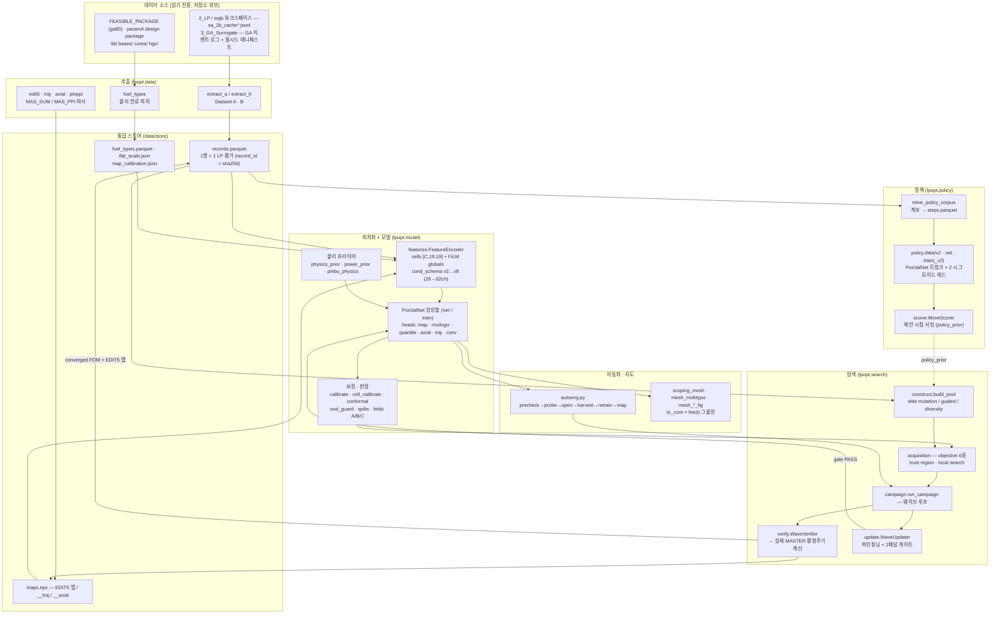
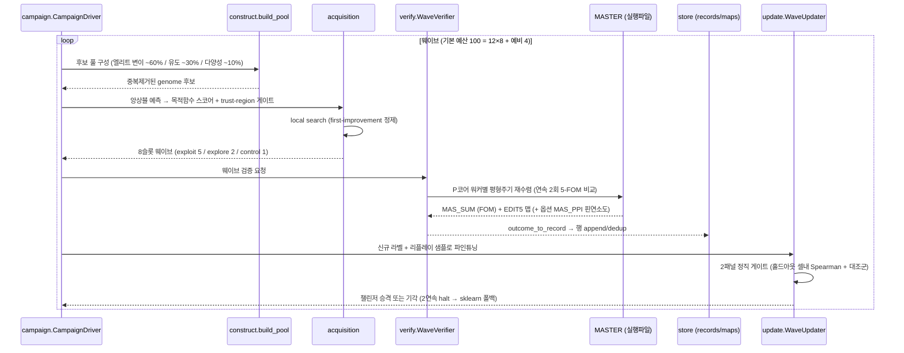
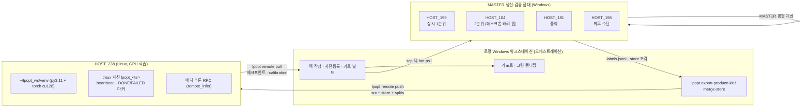

# lpopt 아키텍처

APR1400 평형주기 장전모형(loading pattern, LP) 최적화 시스템의 구조 문서.

`lpopt`은 "예측기"가 아니라 **노심 엔지니어의 작업 루프 전체**를 코드로 옮긴 시스템이다.
기존 MASTER 노심계산 결과를 통합 스토어로 수확(extract)하고, 물리 기반 피처로 인코딩하여
위치-가치 CNN 앙상블(PosValNet)을 학습시키고, 그 앙상블로 후보 장전모형을 선별해
캠페인당 수십~수백 회의 **실제 MASTER 계산**으로 검증하며, 검증 라벨을 스토어에 되먹여
재학습-게이트-탐색 루프를 돌린다. 그렇게 쌓인 캠페인 계보(lineage)에서 개선-스텝을 채굴해
**무브-제안 정책망**(policy v1/v2)을 학습시키고, 이 모든 단계를 셀 단위로 자동 실행하는
**자동 엔지니어**(autoeng)와 설계공간 지도(그물망, mesh)로 이어진다.

> **2026-08-31 개정.** 2026-08-29 목적축 전환(`F_r` → `F_xy`)과 외부 기술 검토 대응으로
> 새 모듈 7개가 들어왔다: `lpopt/safelog.py`(인코딩-안전 로깅), `lpopt/data/fxy.py`
> (`MAS_OUT` FXYP/FXYA 파서), `lpopt/tools/backfill_fxy.py`(소급 라벨), 
> `lpopt/tools/quarantine_campaign.py`(결함 캠페인 격리), `lpopt/tools/repair_parent_ids.py`
> (계보 외래키 수리), 그리고 최상위 `intervention_wave.py`(개입 웨이브 = Campaign A) ·
> `readout_axis.py`(목적축 인식 프런티어 판독). 기존 모듈 쪽 변경은 `policy/scorer.py`의
> `MoveScorerV2` 서빙, `search/campaign.py`의 `is_feasible_search`/`is_deliverable` 분리와
> 안전 실드(OOD/conformal) 배선이다.

- 패키지 진입점: `lpopt` 콘솔 스크립트 (`lpopt.cli:main`) 또는 `python -m lpopt`
- Python >= 3.11 (`tomllib` 사용). `torch`는 **의도적으로 의존성에서 제외**되어 있다 —
  벤더링된 `master_rl` 폐포와 M0 테스트 스위트를 torch 없이 돌리기 위해서이며,
  학습 환경(원격 GPU cu128 / 로컬 CPU)에 따라 별도 설치한다. → [`pyproject.toml`](../pyproject.toml)

---

## 1. 시스템 개요

### 1.1 전체 파이프라인



### 1.2 닫힌 루프 (핵심)

시스템의 심장은 **탐색 ↔ 실계산 ↔ 재학습**의 닫힌 루프다.



포인트 두 가지:

1. **모든 승격은 게이트를 통과해야 한다.** 웨이브 내부 게이트는
   [`lpopt/search/update.py`](../lpopt/search/update.py), 챔피언 교체 게이트는
   `lpopt gate-promote` ([`lpopt/cli.py`](../lpopt/cli.py) `cmd_gate_promote`)가 맡고,
   후자는 **양쪽 모델을 동일한 홀드아웃 행에 라이브 채점**한다(챔피언 in-sample vs
   후보 out-of-sample의 불공정 비교를 구조적으로 금지).
2. **검증 라벨은 곧바로 학습 데이터가 된다.** `harvest_maps = true`인 덱은 수렴한
   EDIT5 맵까지 수확하므로, 맵 헤드(노드 출력 분포)도 캠페인이 실제로 밟은 영역에서
   학습된다.

---

## 2. 패키지 모듈

### 2.1 최상위

| 모듈 | 역할 |
| --- | --- |
| [`lpopt/__init__.py`](../lpopt/__init__.py) | 패키지 선언. 지도학습 위치-가치 모델 + 유도 능동탐색, 그리고 바이트 고정된 `master_rl` 스냅샷 부분집합 재사용. |
| [`lpopt/__main__.py`](../lpopt/__main__.py) | `python -m lpopt` 진입점. |
| [`lpopt/_proc.py`](../lpopt/_proc.py) | 윈도우 콘솔 창 억제. `no_window_flags()` — MASTER/DeCART/TotalBatcher/ssh/scp/tasklist를 `Popen`으로 띄울 때 `CREATE_NO_WINDOW`를 주입한다. 웨이브 하나가 콘솔 창 8개를 띄우는 문제를 막는다. |
| [`lpopt/cli.py`](../lpopt/cli.py) | 2,071줄의 argparse CLI (§2.2). |
| [`lpopt/config.py`](../lpopt/config.py) | TOML `.inp` 덱 → 타입 있는 dataclass (§2.3). |
| [`lpopt/curriculum.py`](../lpopt/curriculum.py) | 셀 순차 커리큘럼 드라이버 (2,894줄). |
| [`lpopt/safelog.py`](../lpopt/safelog.py) | **인코딩-안전 로깅**(138줄). `configure_stdio`(CLI 진입에서 1회 — 모든 맨 `print()`가 좁은 콘솔 인코딩에서 살아남는다) · `safe_logger`/`safe_print`(라이브러리 드라이버용, 호출자가 준 `log=`도 감싼다) · `fold_to_encoding`(`—`→`-`, `≤`→`<=`, `σ`→`sigma` 음역 우선, 최후에 `errors="replace"`). |
| [`lpopt/multi_pc.py`](../lpopt/multi_pc.py) | 다중 PC 생산 키트 export/merge (1,438줄). |
| [`lpopt/remote.py`](../lpopt/remote.py) | 원격 GPU 학습 인프라 (597줄). |

**`safelog.py`가 존재하는 이유 (2026-08-30 사고).** 완주한 100콜 캠페인
(`fpcamp_minfxy_t6t4_f121_r1`, HOST_199)이 `CampaignDriver._render_report`에서
`UnicodeEncodeError: 'cp949' codec can't encode character '—'`로 죽었다 — 런처가
stdout을 로그 파일로 리다이렉트하면 Windows가 ANSI 코드페이지(cp949)를 고르는데 게이트
메시지 하나에 em-dash가 있었다. **MASTER 예산은 이미 다 썼고 `report.md`·`delivery.json`은
끝내 쓰이지 않았다.** 이 모듈이 인코딩하는 규칙: **로그 한 줄이 런을 침몰시킬 수 있어서는
안 된다.** 같은 수정에서 `_render_report`의 post-verify 예외를 격리해 report/status는 항상
기록되게 했고, `lpopt report <run> -i <deck>`로 오프라인 재생성 경로를 열었으며, 루트
`.bat` 12개에 `PYTHONIOENCODING`/`chcp`를 넣었다.

**`curriculum.py`** — `(e_core 밴드 × feed)` 셀 격자를 지지 앵커에서 바깥으로 걸어 나가며
셀마다 크래시 안전 상태기계를 돌린다: `ensure_types → blind_probe → produce_cell →
retrain → validate_gate → done`. 설계 핵심은 "대량 생산 금지" 원칙 — 학습을 늘리기
**전에** 전이 방법론을 먼저 측정한다(`blind_probe`: 현 챔피언이 새 셀을 예측 → 같은
패턴을 MASTER로 라벨링 → 타깃별 예측-실측 오차와 셀내 Spearman 기록).
`CurriculumDriver`, `gate_no_regression`, `gate_legacy_tail`, `certify_gate_coverage`,
`select_band_types`, `select_cell_pairs`, `make_pin_burnup_verifier`, `run_curriculum`.

**`multi_pc.py`** — 두 번째 윈도우 PC가 그대로 `lpopt produce`를 돌릴 수 있는 자기완결
키트를 만든다(셀별 `[[produce.strata]]`가 생성된 `lpopt_kit.inp` + 스토어 사본 + 실행 배치).
`export_produce_kit` / `export_frontier_kit` / `merge_store`(dedup + 원장 병합) /
`render_frontier_schtasks_xml` / `render_run_frontier_bat`.

**`remote.py`** — SSH 위의 서브커맨드: `env-check`(GPU/드라이버/torch + sm_120 CUDA
matmul 스모크/디스크), `push`(tar-over-scp로 소스 + `data/store` + `data/splits` 전송 후
`pip install -e`), `train`(tmux 세션에서 heartbeat + `DONE`/`FAILED` 마커와 함께 기동),
`status`, `pull`, `probe`. `remote_infer`/`make_remote_screener`가 배치 추론을 원격 GPU로
라우팅한다. 접속 파라미터는 전부 덱의 `[remote]` 섹션에서 온다.

### 2.2 CLI 서브커맨드

`lpopt <cmd>` 전체 목록 ([`lpopt/cli.py`](../lpopt/cli.py) `build_parser`):

| 커맨드 | 설명 |
| --- | --- |
| `check` | 설정된 모든 자산 프리플라이트 — 존재 확인 + **첫 64 KiB 실제 읽기**(OneDrive dehydrated placeholder는 존재 테스트를 통과하지만 읽기에 실패한다). 템플릿 덱은 `%LPD_SHF`, 80행 이상의 `%LPD_B&C`, feed-count 토큰 부재까지 검사. |
| `vendor-check` | 벤더링된 `master_rl` 전 파일을 `VENDOR_MANIFEST.json`에 대해 재해시(무결성) + 원본 경로 대비 드리프트 리포트. 무결성 불일치는 exit 1. |
| `fuel-table` | 물리 연료 피처 테이블 빌드 → `data/store/fuel_types.parquet`. |
| `extract` | 2_LP/eqlp(A) + 3_GA(B) 소스에서 통합 스토어 추출. |
| `produce` | 계층화 DoE MASTER 학습데이터 생산 캠페인. |
| `train` | PosValNet 앙상블 학습 (`lpopt.model.train` 위임). |
| `v5-experiment` | 사전등록 v5 통합 A/B (`--dry-run`은 계획 검증·출력만). |
| `eval` | 스플릿 홀드아웃 전반의 앙상블 평가 리포트. |
| `optimize` | 유도 탐색 캠페인 — 시스템의 주 산출 경로. |
| `fuelcost-search` | 최소 연료비(신연료 U-235 총장전량) 구성 외곽 셀-레이스. |
| `report` | `runs/<ts>`의 `report.md` + figure 재생성. |
| `sdm-mtc` | 상위 K개 feasible 후보에 대한 SDM/MTC 사후검증. |
| `remote` | 원격 GPU 학습 (`lpopt.remote` 위임). |
| `boundary-probe` | 셀의 F_r≈1.55 근접 후보 랭킹 (+`--verify`로 MASTER 실행). |
| `curriculum` | 셀 순차 커리큘럼 드라이버. |
| `curriculum-produce` | (내부용, `argparse.SUPPRESS`) 단일 셀 생산 실행. |
| `export-produce-kit` | 배정된 커리큘럼 셀의 이식형 생산 키트 생성. |
| `merge-store` | 반환된 키트 `data/` 폴더를 본 스토어에 병합. |
| `design generate` | 설계 격자 LHS 샘플링 → `dec_FA` 덱 작성. |
| `design run` | 생성된 덱에 DeCART2D 병렬 실행. |
| `design build-lib` | TotalBatcher4로 paramA `MAS_XSL`/`MAS_HFF` 빌드. |
| `design bootstrap` | `(pair, feed)` 밴드-시드 재시작 부트스트랩. |
| `design pathfinder` | 4종 end-to-end 수용 게이트. |
| `geom-validate` | 핀피치/핀반경 기하 변동에 대한 DeCART→MASTER 전이 검증. |
| `frontier-produce` | F_r=1.55 경계 학습 캠페인 1라운드 (생산 PC 워커 모드). |
| `gate-promote` | 정직 무회귀 + 레거시-꼬리 게이트, 통과 시 **원자적 챔피언 승격**. |
| `compliance-audit` | 연료 타입의 1/8 대칭 + `enr_zone = 0.85 × enr_main`(R1/R2) 감사. |
| `debug-panel score` | 챔피언을 MASTER 검증 행에 대해 **중성자물리 단위**(EFPD/ppm/F_r)로 채점. 보고 전용, 항상 exit 0. |

### 2.3 설정 — TOML `.inp` 덱

[`lpopt/config.py`](../lpopt/config.py)는 표준 `tomllib`로 덱을 파싱해 dataclass 트리로 만든다.
**알 수 없는 키는 하드 에러**다: 로더가 매핑되지 않는 모든 키를 모아 전체 목록과 함께
예외를 던지므로, 오타난 `[remote] hosst`가 조용히 무시되는 일이 없다.

| 섹션 | dataclass | 주요 필드 |
| --- | --- | --- |
| `[flow]` | `FlowConfig` | `title`, `output_root`, `random_seed` |
| `[remote]` | `RemoteConfig` | `host`, `user`, `port`, `workdir`, `gpu`, `env`, `tmux_prefix` |
| `[master]` | `MasterConfig` | `executable`, `workers`(0=auto), `timeout`, `max_cycles`, `consecutive`, `tolerances`(하위테이블), `cache_dir`, `keep_success`, `use_all_cores`, `host_reserve` |
| `[verify]` | `VerifyConfig` | `package_root`(FEASIBLE_PACKAGE 레이아웃), `harvest_maps` |
| `[data]` | `DataConfig` | `sources`, `lp_cache`, `lp_case_decks`, `eqlp_ws`, `ga_manifests`, `ga_event_logs` |
| `[case]` | `CaseConfig` | `mode`(`fixed`\|`feed_range`\|`free`\|`user_criteria`), `pair`, `feed`, `feed_range`, `pairs`, `e_core_range` — feed는 **1+4N 격자**만 유효(검증됨) |
| `[fuel]` | `FuelConfig` | `apr1400_root`, `ga80_hgc`, `manual_yaml`, `store` |
| `[extract]` | `ExtractConfig` | `workspaces`, `store_dir`, `reports_dir`, `workers`, `ga_root`, `ga_runs_flow`, `ga_manifest_roots` |
| `[produce]` | `ProduceConfig` | `campaign`, `ledger`, `workers`, `use_all_cores`, `host_reserve`, `chain_timeout`, `resume`, `purge_case_dirs`, `neutral_restart`, `promoted_root`, `template_fallbacks`, `rule_bias_*`, `elite_objective`, `strata` |
| `[[produce.strata]]` | `StratumConfig` | `name`, `library`, `campaign`, `pairs`/`pair_bin`, `feed`, `center_batch`, `split_w1`, `generators`, `n_target`, `priority`, `max_shuffle_depth`, `elite_objective` |
| `[search]` | `SearchConfig` | `pool_size`, `pool_cap`, `elite_frac`/`guided_frac`/`diversity_frac`, `beam_width`, `n_moves_early`/`n_moves_late`, `elite_top_k`, `near_miss_f_r`, `near_miss_top_k`, `elite_seed_cases`, `require_all_fresh_types`, `dry_run_pool_size` |
| `[search.trust_region]` | `TrustRegionConfig` | `enabled`, `feed_step`(=4), `e_core_band`, `n_min`, `promote_after`, `frontier_sigma_inflation`, `frontier_slots_per_wave` |
| `[search.local_search]` | `LocalSearchConfig` | `top_m`, `neighbors`, `depth`, `max_predictions`, `n_moves` |
| `[acquisition]` | `AcquisitionConfig` | 60+ 필드. `budget`, `wave_size`, `exploit`/`explore`/`control`/`reserve`, `objective`, `risk_z`, 제약 상한(`f_r_limit`/**`f_xy_limit`**(=1.65)/`cbc_limit`/`f_q_limit`/`ao_abs_limit`), 목적별 파라미터(`mcmf_*`, `minfr_*`, **`minfxy_*`**, `fuelcost_*`, `fr_boundary_*`, `flatpower_*`(+`flatpower_fxy_limit`)), `policy_prior*`(+`policy_prior_strict`), **안전 실드(`ood_policy`, `conformal_gate`, `conformal_alpha`)**, 게이트(`gate_epsilon`, `gate_skill_*`, `no_improve_waves`) |
| `[model]` | `ModelConfig` | `backend`, `model_dir`, `device`, `library_id`, `store_dir`, `cond_schema`, `map_head_mode`, `map_prior_residual`, `map_spectral_weight`, `inference`(`local_cpu`\|`remote_gpu`), `remote_screening*`, `cyclen_physics_prior`, `quantile_heads`, `promote_max_asm_bu`, **`promote_fxy`**(`f_xy` 헤드 서빙), `auto_fit_cell_calibration` |
| `[design]` | `DesignConfig` | `decart_exe`, `master_exe`, `apr1400_root`, `paramA_root`, `package_root`, `n_types`, `max_parallel`, `decart_timeout`, `bootstrap_max_cycles`, `enable_pin_burnup`, `mas_ref`, `prolog_exe`, `totalbatcher_exe` |
| `[curriculum]` | `CurriculumConfig` | `state_dir`, `e_core_bands`, `feeds`, `anchor_band`/`anchor_feed`, `cell_order`, `probe_size`, `n_target`, `retrain_mode`, `retrain_split`, 게이트 파라미터(`gate_noreg_*`, `gate_tail_*`, `gate_new_cell_min_spearman`), `band_libraries` |
| `[criteria]` | `CriteriaConfig` | `user_criteria` 자유탐색: `e_core_target`/`tol`, `split_range`, `cyclen_target`/`tol`, `discharge_target`/`tol`, 제약 상한, `search_mode`, `lean_*`, `outer_*`, `power_mw`, `hm_mtu` |
| `[constraints]` | `ConstraintsConfig` | `mtc_enable`, `mtc_max/min_pcm_per_c`, `sdm_enable`, `sdm_required_pcm`, `post_verify_top_k` |
| `[sdm_mtc]` | `SdmMtcConfig` | `top_k`, MTC/SDM 한계, `cea_allowance_pcm`, `scram_banks`, `stuck_candidate_banks`, `branch_timeout_s`, `sidecar_path` |
| `[debug_panel]` | `DebugPanelConfig` | `campaigns`, `tolerances` |

검증 헬퍼: `_validate_objective`(허용 목적함수만), `_validate_policy_prior`
(`off`/`fr`/`flat`/`both`/`v1`/`v2`/`shadow_v2`), `_validate_cond_schema`(피처 모듈의
`CHANNELS_BY_SCHEMA`에서 직접 조회 — 설정과 인코더가 서로 어긋날 수 없다),
`_validate_inference`, **`_validate_ood_policy`**(`warn`/`escalate`/`reject`),
**`_validate_conformal_alpha`**(적합된 아티팩트가 실제로 갖고 있는 α만 허용 — 없는 α를
요구하면 조용히 다른 분위수를 쓰는 대신 하드 에러). 그리고 `fr_guard_enforced` /
`fr_guard_from_deck`.

**허용 목적함수(objective)** — `target_cycle`, `max_cycle_min_fr`, `min_fr_max_cycle`,
**`min_fxy`**, `min_fuel_cost`, `fr_boundary`, `flat_power`.

**2026-08-29에 추가된 축.** `min_fxy`에서 `f_xy`는 **목적이자 경성 한계**(1.65)이고
`F_r`은 **제약으로 남는다**(`f_r_limit` 1.55) — 두 축은 실제 노심에서 순서가 바뀌므로
어느 쪽도 다른 쪽을 함의하지 않기 때문이다. `flat_power`에도 `flatpower_fxy_limit`
안전게이트가 추가됐다(`node_peak`은 `F_xy`가 **아니다** — 상관 0.74–0.85).
안전 실드 3종의 **기본값은 전부 기존 동작**이다(`ood_policy = "warn"`,
`conformal_gate = false`) — 켜는 것은 덱의 선택이다.

### 2.4 `lpopt/data/` — 추출·스키마·스토어·라벨 정의

| 모듈 | 요약 |
| --- | --- |
| [`extract_a.py`](../lpopt/data/extract_a.py) | Dataset A 추출(814줄). 3개 워크스페이스 11개 `sa_2b_cache*.jsonl` 스캔 → 회전 정규화 정렬 키로 중복제거 → `run_meta.json` 기반 라이브러리 해석(미해결은 `library_id="unresolved:<names>"`로 태깅해 세는 방식, 추측 금지) → 케이스 디렉터리 인덱싱·수확. `run_extract_a`, `dedup_key_of`, `build_records`, `write_report`. |
| [`extract_b.py`](../lpopt/data/extract_b.py) | Dataset B 추출(808줄). 3_GA 코퍼스는 FOM 라벨과 장전모형이 **분리된** 아티팩트에 있어 재조인이 필요하고, 상당수 상류가 OneDrive dehydrated 상태다. GA 이벤트 로그(`ga_generations_*.jsonl`) 스캔 + 웜시드 매니페스트 스캔 + 패턴 인덱스 복구. `run_extract_b`, `scan_event_logs`, `build_pattern_index`, `scan_manifest`. |
| [`schema.py`](../lpopt/data/schema.py) | 통합 스키마. `record_id = sha256(canonical_pattern_string \| library_id \| case_pair \| deck_knobs_string)` (64-hex). `CanonicalRecord`, `compute_record_id`, `pack_pattern`/`unpack_pattern`. |
| [`store.py`](../lpopt/data/store.py) | 스토어 I/O. `StoreWriter`(record_id 기준 append/dedup, 동일 디렉터리 임시파일 + `os.replace`로 **원자적** parquet 쓰기, float16 EDIT5 맵 스택 동반 저장), `StoreReader`(지연 맵 로드). 쓰기 도중 실패해도 부분 스토어가 남지 않는다. |
| [`fuel_types.py`](../lpopt/data/fuel_types.py) | **물리 연료 피처 테이블**(2,244줄, 시스템에서 가장 큰 데이터 모듈). `(library_id, type_id)`당 1행. 소스 우선순위: `FA_*.out` MASS → 농축도/U질량, `FA_*.sum`, HGC(2군 단면적·pin form function 최대치·ADF·핀연소도), `dec_FA` 덱(재료/기하/존 인구조사). 핵심 함수: `kconv_curve_shape`(k-inf(BU) 곡선 형상 인자 — 독봉 불가지론 채널), `parse_hgc_boc_xs_adf`, `parse_fa_sum_pin_bu`, `geom_derived`, `ga80_rows`, `paramA_rows`, `build_fuel_table`, `augment_fuel_table_{pin_bu,geometry,kinf_shape}`, `pair_e_core`/`mix_e_core`/`case_e_core`, `FuelLibrary`. |
| [`geometry.py`](../lpopt/data/geometry.py) | 정준 1/4 노심 기하. MOCHA rot61 캐시 키(61개 독립 최적화 셀) ↔ mirror-69 벤더 `Pattern`(69 슬롯) 상호 변환. `QuarterCell`, `slot_index_of`, `to_canonical_from_cache_key`, `to_canonical_from_shf`, `transpose`. |
| [`edit5.py`](../lpopt/data/edit5.py) | MASTER4 `MAS_SUM` EDIT2/EDIT5 파서. `2_LP/MOCHA/master_sum.py`에서 파싱 로직을 **그대로** 이식(상류 파일은 편집 금지). `parse_mas_sum`, `Summary`, `AssemblyMaps`, `cbc_boc`/`cbc_max`, `extract_maps`, `stack_maps`, `stack_step_maps`, `stack_axial`. |
| [`fxy.py`](../lpopt/data/fxy.py) | **MASTER4 `MAS_OUT` PLANAR 첨두 파서**(245줄) — `FXYP`(핀) / `FXYA`(집합체). `edit5.py`(MAS_SUM)·`pinppi.py`(MAS_PPI)에 이은 **세 번째 비벤더 MASTER 출력 파서**다. `F_xy`가 왜 별도 파일이냐 — **`MAS_SUM`에 없다**(EDIT3는 `FQN FRN FQP FRP`만 싣는다). MASTER는 감손 스텝마다 `$P2D_n` 블록을 찍고 그 안에 평면 인자를 정확히 한 번 인쇄한다. 값의 정의는 **평형 최종 사이클의 전 감손 스텝 최댓값**(설계 한계가 주기 내내 적용되고, 스토어의 `max_frp`/`max_fqp`가 이미 같은 규약이므로 다른 규약을 쓰면 축 간 비교가 깨진다). 어느 작업 디렉터리가 최종 사이클인지 고르는 것은 **호출자의 일**이다. 파싱 정규식과 "사이클 최댓값" 규약은 `2_LP/MOCHA/master_sum.py`에서 이식했고 상류 파일은 편집·임포트하지 않는다. 함정 하나가 실제로 걸렸다 — `PIN     PLANAR` 사이의 **공백 연속** 때문에 단일 공백 리터럴 grep은 아무것도 못 찾는다(모든 간격이 `\s+`). |
| [`flatness.py`](../lpopt/data/flatness.py) | **`node_peak`·`map_cov`의 단일 정의**(다중도 가중). 수확 경로·백필·A/B 채점·출력맵 프라이어 적합이 전부 여기서 import한다(정의가 두 벌이 되어 숫자가 어긋났던 사고의 교정). `node_peak`, `map_cov`, `flatness_pair`, `gradient_stats`, `radial_weighted_power`, `record_flatness`. |
| [`flat_scale.py`](../lpopt/data/flat_scale.py) | 평탄도 목적함수의 정규화 스케일. `z_peak = node_peak/PEAK_SCALE`, `z_cov = map_cov/COV_SCALE`, `scalar = −(z_peak + w_cov·z_cov)`. 선언된 1:0.5 가중비가 의미를 갖게 하는 상수와 그 아티팩트를 소유. `CellScale`, `FlatScale`, `load_gate_correction`. |
| [`map_calibration.py`](../lpopt/data/map_calibration.py) | 셀별 맵-헤드 **레벨** 보정(`map_calibration.json`). 맵 헤드는 정직한 fold-C 슬라이스에서 낙관 편향을 갖고, 인수 함수의 유일한 비관 항(`risk_z × 앙상블 산포`)은 인식론적 불일치 통계라 외삽 편향을 표현할 수 없다. `MapCalibration`, `TargetCalibration`, `model_fingerprint`, `gate_shift`, `ModelMismatchError`. |
| [`axial.py`](../lpopt/data/axial.py) | 축방향(EDIT 6) 출력 형상 라벨. `maps.npz`의 `<record_id>__axial` `float16[n_steps, 25]`가 무엇을 뜻하는지 아는 유일한 곳(방향은 BOTTOM→TOP). `load_axial`, `axial_peaking_factor`, `axial_offset`, `axial_shape_index`, `saddle_depth`, `AxialBasis`, `fit_axial_basis`. |
| [`traj.py`](../lpopt/data/traj.py) | EDIT5 **연소 궤적** 라벨. `<record_id>__traj` `float16[n_steps, 3, 9, 9]`(planes = power/burnup/kinf). 레거시 4-plane 스택은 궤적의 양 끝점만 보관한다. `load_traj`, `slot_mean_burnup`, `cycle_burnup_fraction`, `anchor_indices`, `stack_anchor_traj`. |
| [`pinppi.py`](../lpopt/data/pinppi.py) | MAS_PPI에서 **HZ 가중 봉평균 핀연소도** 축약. 벤더 파서가 뽑는 것은 NODE 피크(최대 집합체 1개 안의 최고 축방향 층)뿐인데, 인허가 질문은 같은 3-D 배열의 **다른** 축약(핀별 축방향 평균의 전 집합체 최대)이다. `parse_ppi_assembly_rod_average`, `parse_ppi_core_rod_average_peak`. |
| [`compliance.py`](../lpopt/data/compliance.py) | 집합체 설계 준수 규칙 R1–R3. ga80 문자 타입 라이브러리는 `enr_main`/`enr_zone` 부기를 잃어 44/80 타입은 정직한 종단 상태 `'unknown'`이다(학습 라벨 생산용으로는 유지, 최종 설계로는 미보고). `audit_types`, `octant_symmetry_flag`, `zone_ratio_flag`, `enforce_new_type`. |

### 2.5 `lpopt/model/` — 학습·보정·판정

**핵심 3종**

| 모듈 | 요약 |
| --- | --- |
| [`net.py`](../lpopt/model/net.py) | **PosValNet**. 입력은 `cells [B,C,19,19]` 물리 채널 + `globals [B,G]` FiLM 조건 벡터. 헤드는 (1) **map head** `[B,4,9,9]` 슬롯별 EDIT5 정규화값(BOC/EOC 출력, EOC 연소도/kinf) — 69개 1/4 슬롯 마스킹된 다중과제 공간 정칙화, (2) **global head** 타깃별 `mu` + `log_sigma_alea`, (3) **convergence** 로짓. 선택 헤드(전부 기본 off, off일 때 state_dict·파라미터 수가 이전 넷과 바이트 동일): quantile(pinball), multi-scale map decoder, 물리 프라이어 잔차 맵, axial, traj. `PosValNetConfig`, `FiLM`, `ResidualBlock`, `MultiScaleMapDecoder`, `build_member`. |
| [`train.py`](../lpopt/model/train.py) | 학습 루프(2,927줄). `python -m lpopt.model.train --ensemble 5 --split S1 …`. 타깃 z-정규화 상수는 **train 스플릿의 수렴·유효 행에서만** 계산해 체크포인트 meta에 저장. 손실은 z-스케일 Huber(δ=1) + heteroscedastic β-NLL 래퍼(warmup 20에폭 μ만 학습 후 NLL 활성, β=0.5). 부가 손실: `map_loss`, `traj_loss`, `spectral_map_loss`, `axial_loss`, `convergence_loss`, `cyclen_rank_loss`/`f_r_rank_loss`(셀내 pairwise 랭크), `map_fr_consistency_loss`, `pinball_loss`. `train_ensemble`, `fit_cell_calibrations`, `attach_cyclen_prior`, `attach_distill_targets`. |
| [`model_api.py`](../lpopt/model/model_api.py) | 서빙 인터페이스(1,975줄). `PositionValueModel` Protocol의 `predict`가 벤더 `SurrogatePrediction` 7열 레이아웃 `(F_r, CBC_max, F_q, cyclen, AO_abs, max_assembly_burnup, max_pin_burnup)`을 그대로 돌려주므로 벤더 `RewardModel`을 무수정 재사용한다. `PosValCnnBackend`, `QuantileSurrogatePrediction`, `IntervalPrediction`, `EncoderChannelMismatch`. |

**피처·데이터**

- [`featurize.py`](../lpopt/model/featurize.py) (1,619줄) — 누출 안전 물리 피처화.
  `FeatureEncoder`가 한 스토어 레코드를 `cells float32[C,19,19]` + `globals float32[G]`로
  변환한다. 남동 1/4의 69개 `%LPD_SHF` 슬롯을 전체 17×17 연료격자로 mirror-expand.
  **`cond_schema` 인벤토리**(채널 수):

  | schema | 채널 | 비고 |
  | --- | --- | --- |
  | `v2` / `v3` | 26 | feed 121 고정(v2) / 확장 포락(v3) |
  | `v4` | 43 | 격자 조건 채널 확장 |
  | `v5` | 48 | **독봉 불가지론** — Gd 특정 채널 제거 + k-conv 형상 9채널 |
  | `v5_noshape` | 40 | v5에서 형상 채널 제거 (어블레이션 대조군) |
  | `v6` | 52 | hires 번들: 국소대비 + 확산 출력 프라이어 채널 |
  | `v6_contrast` / `v6_prior` | 50 / 50 | v6 분해 arm |
  | `v6b` | 58 | **소스체인 연소상태** 6채널 추가 |
  | `v6c` | 62 | face-ADF 채널 (판정 결과 REJECT) |
  | `v7` / `v8` | 62 | 셀 인벤토리는 v6c와 동일, **글로벌 벡터만** 확장(다종 조성 모멘트) |

- [`dataset_torch.py`](../lpopt/model/dataset_torch.py) — `LPDataset`. 온더플라이 피처화 +
  **원시** 타깃 반환(z-scoring은 학습 루프 소관). 타깃 순서
  `TARGETS = (f_r, f_q, cbc_max, cyclen, ao_abs, discharge_burnup, max_pin_burnup)`,
  `promote_max_asm_bu=True`이면 `max_assembly_burnup`을 **뒤에 append**(삽입 금지 —
  `cyclen == 3` 같은 기존 인덱스가 랭크 손실·셀 보정의 키이므로 불변이어야 하고,
  7-타깃 체크포인트도 계속 읽힌다). `compute_cell_weights`, `cyclen_cell_codes`,
  `cbc_provenance_codes`.
- [`splits.py`](../lpopt/model/splits.py) — 결정론적 스플릿 매니페스트 S0…S4.
  **S1은 조상 폐포 그룹 스플릿**(`campaign` 태그와 `parent_record_id` 계보 간선에 대한
  union-find의 연결 성분 단위 홀드아웃 — G3 자식이 val에 있는데 부모가 train에 있는
  일이 없다). S2 leave-pair-out, S3 feed 필터, S4 e_core 밴드.
  `make_curriculum_split`은 셀별 안정 해시 80/20 홀드아웃(성장 불변).
- [`folds.py`](../lpopt/model/folds.py) — 평가 fold A/B/C를 라이브러리로 코드화.
  fold C는 **스플릿 동결 이후에 생성된 행**의 집합 차분으로 정의되는 무오염 슬라이스이며,
  A/B 결정 규칙과 승격 게이트가 모두 이것을 읽는다.
- [`c2_slice.py`](../lpopt/model/c2_slice.py) — C2 판정 슬라이스. fold C만으로는 남는
  세 가지 누출(계보/캘리브레이션/셀 공유)을 정제해서 제거하고, 스토어 지문이 스플릿보다
  새로우면 `SplitStaleError`로 **거부**한다. `build_c2`, `audit_split`, `require_program_split`.

**보정·불확실성**

- [`calibrate.py`](../lpopt/model/calibrate.py) — 타깃별 isotonic σ 보정(S1-val 앙상블
  잔차만 사용) + convergence 로짓의 Platt 보정. `calibration.json`에 순수 배열로 저장
  (pickle 금지 — state_dict+meta 이식성 규칙). `apply_calibration`은 이름 기반 매핑을
  써서 부분집합·순서변경에도 안전하다.
- [`cell_calibrate.py`](../lpopt/model/cell_calibrate.py) (1,247줄) — 셀별 cyclen 편향
  보정(2단). 전역 z-스케일 손실이 거대한 feed-121 코퍼스에 지배되어 셀-조건부 평균이
  Dataset-A 체제로 수축하는 문제를 어파인 보정으로 되돌린다. `fit_cell_affine*`(cyclen,
  f_r, cbc, fq, ao), `fit_flatness_calibration`, `apply_affine_calibration`,
  `CampaignBiasCorrector`.
- [`conformal.py`](../lpopt/model/conformal.py) — 타깃별 split-conformal 예측구간.
  보정된 σ는 유한표본 커버리지 보장이 아니므로, 교환가능 데이터에 대한 분포무관 주변
  커버리지 보장을 **가산적·보고 전용**으로 얹는다. `fit_conformal`, `halfwidths`,
  `kfold_cell_coverage`, `coverage_table`.
- [`ood_guard.py`](../lpopt/model/ood_guard.py) — 서빙 시점 피처/기하 OOD 가드. 챔피언의
  핀셀 기하는 학습 코퍼스에서 **상수**이고, 앙상블의 인식론적 분산은 off-manifold 편향에
  구조적으로 눈이 멀어 있다(전 멤버가 같은 manifold에서 학습되어 나란히 틀린다).
  `population_envelope`, `vec_ood_channels`, `format_ood_warning`.

**물리 프라이어**

- [`physics_prior.py`](../lpopt/model/physics_prior.py) — cyclen을 직접 회귀하는 대신
  선도차수 **반응도 균형** 폐형식 추정치에 대한 잔차를 회귀한다. 입력은 `fuel_types`에
  이미 수확된 k-inf(BU) 곡선 형상(`kinf_peak`, `bu_peak_gwd`, `reactivity_swing_pcm`,
  `depletion_slope_pcm_per_gwd`). `CyclenPhysicsPrior`, `fit_cyclen_prior`.
- [`power_prior.py`](../lpopt/model/power_prior.py) — 241 집합체 노심의 1군 조대격자
  확산 고유치 해로 **공간** 선도해(69 슬롯 상대출력 맵)를 준다. 출력 격자가
  `edit5._quadrant`의 `boc_power` 라벨 격자와 정확히 같아 `label = prior + residual`이
  정확한 왕복이 된다. `PowerPrior`, `power_maps_from_kinf`, `fit_power_prior`.
- [`pinbu_physics.py`](../lpopt/model/pinbu_physics.py) — 서빙 측 물리 핀연소도 추정기
  (재학습 없음). 원시 `max_pin_burnup` 헤드는 셀내 out-of-sample 일반화에 실패한다:
  Dataset A의 지배적 교사 라벨이 대리값(`≈1.08 × 집합체`)인 반면 실제 MAS_PPI 라벨은
  `≈1.18 ×`로 **물리적 정의가 다르다**. `PinBuRatioCurve`, `PinBuPhysicsEstimator`,
  `fit_pinbu_physics`.

**A/B 판정 하네스 · 베이스라인 · 서빙 보조**

| 모듈 | 요약 |
| --- | --- |
| [`ab_eval.py`](../lpopt/model/ab_eval.py) | arm 시작 **전에** 고정된 지표로 채점. 측정 대상은 오차 크기가 아니라 **유효 분해능**(한 설계 셀 안에서 얼마나 작은 실제 차이까지 순서를 맞추는가). `resolution_curve`, `within_cell_sd`, `effective_resolution`, `cluster_bootstrap_ci`, `map_spectrum`, `no_regression_gate`. |
| [`ab_paired.py`](../lpopt/model/ab_paired.py) | **쌍체·셀 클러스터** 부트스트랩 추론. 모든 arm이 같은 C2 행에서 평가되므로 쌍체 차이가 정답이고, 단일 arm의 주변 CI 두 개를 나란히 읽는 것은 추론이 아니다. `paired_cell_bootstrap`, `PairedDiff`. |
| [`ab_score.py`](../lpopt/model/ab_score.py) | arm 채점 + 사전등록 결과 테이블 누적. 추론을 `model_api`가 아니라 각 멤버 `meta.json`에서 재구성한다(서빙 경로가 동시 수정 중일 때 판정이 움직이는 파일에 의존하지 않도록). |
| [`ab_watch.py`](../lpopt/model/ab_watch.py) | GPU 박스를 폴링해 끝난 arm을 pull·채점. arm 식별은 `run.sh`의 학습 플래그 **서명**(cond_schema/width/n_blocks/head_hidden/map decoder/prior residual/spectral weight)으로 — 손으로 유지하는 ts↔arm 표는 재실행 즉시 낡는다. |
| [`ab_decide.py`](../lpopt/model/ab_decide.py) | 사전등록 결정 규칙 적용 → 승자 + 승격 커맨드. `--promote`는 `lpopt gate-promote`까지 실행. 규칙은 arm 기동 전 확정되어 이 파일에 축자 전사되어 있다. |
| [`flat_ab.py`](../lpopt/model/flat_ab.py) · [`flat_metrics.py`](../lpopt/model/flat_metrics.py) | 평탄도 A/B 판정 장치. `FlatArena`는 **대조군 예측 없이는 생성 자체가 불가능**하고, 모든 지표는 `{cell_key: value}` 형태다(셀이 부트스트랩 재표집 단위이므로 단일 스칼라로 붕괴하는 지표는 판정할 수 없다). `regret_at_k`, `sign_hit_band`, `flat_tercile_rho`, `normalized_precision_at_k`, `truncated_band_auc`. |
| [`al_retrain.py`](../lpopt/model/al_retrain.py) | 챔피언 레시피 충실 재현 능동학습 재학습. 평범한 `remote train --ensemble 5 --split S1`은 챔피언 하이퍼파라미터(width·증류·물리 프라이어·분위수 헤드·자동 셀보정·승격 asm-BU)를 전부 버려 게이트를 통과할 수 없었다. `champion_recipe`, `recipe_to_train_args`, `plan_al_retrain`. |
| [`distill.py`](../lpopt/model/distill.py) | 셀별 최적 과거 교사에서의 soft-target 증류. **행 선별 없음**(학생은 전체 코퍼스 학습), 앙상블 붕괴 없음. `build_soft_targets`, `validate_teacher_map`. |
| [`v5_experiment.py`](../lpopt/model/v5_experiment.py) | 사전등록 v5 4-arm 실험(`v4_baseline`/`v5_full`/`v5_minus_shape`/증류판). arm·시드·스플릿·홀드아웃·결정 지표가 어떤 arm이 학습되기 전에 전부 고정된다. |
| [`evaluate.py`](../lpopt/model/evaluate.py) | 앙상블 평가 리포트(스플릿×타깃별 MAE/RMSE/R², 케이스내 Spearman, risk-coverage, ExtraTrees 대비, 수용 판정). |
| [`baseline_trees.py`](../lpopt/model/baseline_trees.py) | 타깃별 ExtraTrees 베이스라인(슬롯 채널 행렬 `(C,69)` + FiLM 글로벌 = 1,804 피처 — CNN의 4× mirror 중복 회피). |
| [`model_sklearn.py`](../lpopt/model/model_sklearn.py) | `sklearn_fallback` 백엔드. 게이트 2회 연속 halt(`MODEL_HALT` 열화 경로)에서 재적합하며, 전체 acquisition/campaign 스택의 torch-free 테스트 더블이기도 하다. |
| [`remote_infer.py`](../lpopt/model/remote_infer.py) | lean `user_criteria` 스크린용 원격 배치추론 RPC. **피처가 아니라 패킹된 패턴을 보내고 원격에서 인코딩**한다(인코더 결정론 + 서버에 이미 있는 `fuel_types.parquet` → 바이트 동일). |

### 2.6 `lpopt/search/` — 후보 생성·인수·검증

| 모듈 | 요약 |
| --- | --- |
| [`campaign.py`](../lpopt/search/campaign.py) | 캠페인 드라이버(4,105줄, `lpopt optimize`). `run_campaign`이 웨이브 루프를 돈다: 풀 구성 → 서로게이트 스코어 + trust-region 게이트 → local search 정제 → 8슬롯 웨이브 구성(exploit 5/explore 2/control 1) → `WaveVerifier` 검증 → 스토어 append → 파인튜닝 게이트. `CampaignDriver`, `UserCriteriaDriver`, `WaveReport`, `CampaignResult`, `feasibility_limits_for`, **`is_feasible_search`/`is_deliverable`/`unknown_axes`/`deliverable_limits`**, `MapHarvestAbort`. |
| [`genome.py`](../lpopt/search/genome.py) | **feed-일반 orbit-unit 게놈**. 벤더 `OrbitGenome`은 feed 121(=1+4·30)의 depth-1 완전 매칭(신연료 30 + 연소 30)만 표현한다. `GeneralOrbitGenome`은 burned 유닛이 다른 burned 유닛에서 셔플되는 **depth-2 소스체인**을 허용해 1+4N 격자의 임의 feed(혼합 2/3-batch 노심)로 확장한다. `graded_morph`(2종 부모 → 3종 이상 자식), `mutate`, `random_genome`, `fresh_units_from_feed`. |
| [`construct.py`](../lpopt/search/construct.py) | 후보 풀 구성. 세 소스의 계획 비율: **엘리트 변이 ~60%**(케이스의 상위 검증 행 + 직전 웨이브 상위 예측 후보를 작은 `n_moves`로 변이, 웨이브가 갈수록 넓어짐), **유도 ~30%**, **다양성 ~10%**. `[acquisition] policy_prior`(기본 `off`)가 켜지면 각 부모의 무브 후보를 정책망이 랭킹한다. `build_pool`, `CaseContext`, `screen_e_core_band`, `build_pair_universe`. |
| [`acquisition.py`](../lpopt/search/acquisition.py) | 인수·trust region·local search·웨이브 구성(2,685줄). 스코어링 스택은 **의도적으로 벤더의 것**이다: `build_reward_model`이 벤더 `RewardModel`을 `target_cycle` 모드로 만들고 그 `score`/`acquisition`이 `SurrogatePrediction`을 무수정 소비한다. `p_feasible`은 `Π Φ((limit−μ)/σ_total)` × 수렴확률. 목적함수별 스코어러: `score_max_cycle_min_fr`, `score_min_fr_max_cycle`, `score_min_fuel_cost`, `score_fr_boundary`, `score_flat_power`. `TrustRegion`, `ScoredPool`, `local_search`, `WaveSlot`, `rank_with_tiebreak`. |
| [`verify.py`](../lpopt/search/verify.py) | MASTER 웨이브 검증 하네스(1,201줄). 스냅샷 `master_rl/flow.py`의 `_ga_case_evaluator` 충실 이식: 성능코어 워커당 MASTER 평형 러너 1개, 벤더 `ParallelPatternEvaluator` 스케줄링(P코어가 물리를 소유하고 호스트는 E코어로 물러난다). GA 평가기와의 차이는 전부 가산적 — produce 웨이브는 **이종 케이스**(서로 다른 pair/feed/restart)를 섞는다. `WaveVerifier`, `PurgingEquilibriumRunner`, `HarvestingEquilibriumEvaluator`(EDIT5 맵·궤적·축방향 고해상 수확), `WatchdogMasterRunner`, `classify_outcome`, `outcome_to_record`. |
| [`update.py`](../lpopt/search/update.py) | 온라인 웨이브 업데이트. 웨이브마다 신규 8라벨 + 리플레이 샘플로 로컬 CPU 파인튜닝 → **챌린저**. 두 패널이 모두 동의할 때만 챔피언 교체: (1) 동결된 `(feed, e_core)` 층화 홀드아웃의 **케이스내 Spearman**(절대 MAE 비가 병적으로 되는 초밀집 feasible 클러스터에 강건), (2) 대조군 패널. `WaveUpdater`, `Panel`, `GateResult`, `halt_primaries`. |
| [`produce.py`](../lpopt/search/produce.py) | 학습데이터 생산 드라이버(1,485줄, `lpopt produce`). 인수함수 없는 `WaveVerifier` 하네스의 웨이브판 — 계층화 DoE 샘플러가 `[[produce.strata]]` 셀을 MASTER 평형 라벨로 채운다. 생성기 G1 `random`, G2 `heuristic`(링/체커보드/방사형 사전분포를 임의 N으로 일반화), G3 `elite_perturb`, G4. `ProduceDriver`, `Ledger`(append-only 원장), `run_produce`. |
| [`assets.py`](../lpopt/search/assets.py) | 케이스 자산 해석(943줄). 새 `(pair, feed)` DoE 셀은 자기 재시작·템플릿 덱을 갖는 일이 드물다. `CaseAssetResolver`가 **5단 폴백 사다리**(0 native → 1 promoted → 2 pair_feed → 3 pair_ecore → 4 synth)로 최선의 재시작과 읽을 수 있는 템플릿을 찾고, 엄격한 벤더 `MasterRunner`가 받아들이도록 덱의 재시작 참조를 재작성한다. `validate_reload_deck`, `synth_roster_for`. |
| [`resolver.py`](../lpopt/search/resolver.py) | 라이브러리별 라우팅 리졸버 팩토리. **ga80**(하네스 네이티브 FEASIBLE_PACKAGE) → `[verify].package_root`; **paramA**(주문형 파라메트릭 라이브러리) → 조립된 설계 패키지 자체의 `bases/ cores/ lib/` + `registry.json`의 `type_id → alias` 브리지. `build_case_resolver`, `is_paramA_library`, `paramA_library_dims`. |
| [`frontier_search.py`](../lpopt/search/frontier_search.py) | `(pair, feed)` 설계격자 위의 **외곽 셀-레이스**(937줄). 두 모드·두 배분 규칙: `fr_boundary`(어느 설계 셀이 F_r≤1.55에 도달 **가능한가** — 설계공간 매핑이지 노심장전 목적이 아니다)와 평탄도 모드. `FrBoundaryOuterRace`, `build_roster`, `round1_weights`, `proximity_weights`, `coverage_weights`. |
| [`fuelcost_search.py`](../lpopt/search/fuelcost_search.py) | 최소 연료비 외곽 레이스. `FE`(신연료 U-235 총장전량)는 **위치 불변**이라 한 `(pair, feed)` 셀 안의 모든 LP가 같은 `FE`를 갖는다 — 그래서 셀 레이스지 패턴 탐색이 아니다. `enumerate_cells`, `dedup_by_composition`, `prerank_cells`, `eliminate_dominated`, `race_allocation`. |
| [`boundary_probe.py`](../lpopt/search/boundary_probe.py) | F_r 경계 마이크로 검증 하네스. 커리큘럼 정직 홀드아웃에 `F_r≤1.55` 근방 수렴행이 **0개**라, 챔피언이 임계 근처 라벨을 본 적이 없다는 문제를 직접 공략한다. `generate_pool`, `rank_pool`, `verify_candidates`, `run_boundary_probe`. |
| [`sdm_mtc.py`](../lpopt/search/sdm_mtc.py) | SDM/MTC 사후검증(1,711줄). MTC(감속재온도계수)/SDM(정지여유)은 **사용자 설정 설계·인허가 제약**이지 모델 예측 FOM이 아니다. 상위 K개 수렴·규격 feasible 후보의 최종주기 덱 + 수렴 재시작에서 MASTER **branch** 덱을 합성해 후보당 ~2회 추가 계산(평형 재수렴 없음). `run_post_verification`, `RodModel`, `LicensingLimits`, `MtcResult`, `SdmResult`, `post_verify_topk`. |
| [`rule_metrics.py`](../lpopt/search/rule_metrics.py) | 공개 문헌 PWR 장전 규칙 지표 RM1–RM6. 전부 순수 `pattern → float`이며 **어느 것도 제약이 되어서는 안 된다**(장전 휴리스틱을 하드 제약으로 승격하면 탐색공간이 잘리면서 최적해도 같이 사라진다 — 원 보고서의 "Ring-of-Fire" 교훈). `rm_fresh_face_adjacency`, `rm_fresh_diag_adjacency`, `rm_reactivity_mismatch`, `rm_fresh_periphery`, `rm_peripheral_power_share`, `rm_checkerboard_degree`, `rule_penalty`(기본 가중 0.0). |
| [`delivery.py`](../lpopt/search/delivery.py) | 납품 후보 선정. **탐색 목적함수의 일부가 아니다** — 탐색은 평탄도이고 F_r을 포함하지 않는다. 이미 존재하는 행들 위에서 "만든 평탄한 패턴 중 무엇을 인허가 검토에 넘길 것인가"라는 다른 질문에 답한다. `select_delivery`, `DeliveryCandidate`, `compliance_margin`. |
| [`stub.py`](../lpopt/search/stub.py) | 결정론적 가짜 MASTER 평가기. `StubEvaluator`가 벤더 `PatternEvaluator` 프로토콜을 만족시켜 웨이브 디스패치/원장/재개/스토어 행/QC 카운터 전체를 실행파일·네트워크 없이 end-to-end로 돌게 한다(`produce --dry-run`, 테스트). |

**두 개의 실현가능성 술어 (2026-08-29, 외부 검토 §6.4 / P0-03).** 하나였던
`is_feasible`이 둘로 갈라졌다.

| 술어 | 계약 | 쓰이는 곳 |
|---|---|---|
| `is_feasible_search` | **탐색 계약** — `max_pin_burnup`과 `f_xy`는 **결측이면 통과**, 나머지 게이트 축(`cbc_max`/`f_q`/`ao_abs`/`f_r`/`cyclen`)은 **결측이면 거부** | 후보 랭킹, 엘리트 풀, best-tracking, 외곽 가중, `n_feasible`, 리포트 통계 |
| `is_deliverable` | **납품 계약** — 게이트된 **모든 축이 측정되어 있고** 전부 인허가 한계 안. `unknown_axes`가 무엇이 없는지 이름을 댄다 | 납품 판정, `delivery.json`, 검토 Phase-A 종료 기준("UNKNOWN 납품 0건") |

관대한 쪽이 필요한 이유는 실제적이다 — 새 축의 첫 라벨이 도착하기 전에 엄격히 거부하면
실현가능 집합이 0이 되어 **탐색이 굶는다**. 목적축이 바뀐 순간 스토어의 **98.2%에 `F_xy`
라벨이 아예 없었으므로**, 엄격한 거부였다면 첫 `min_fxy` 캠페인은 **시작조차 못 했다**.
엄격한 쪽이 필요한 이유도 실제적이다 — **측정되지 않은 인허가 축을 만족했다고 부를 수 없다.**
`NaN == 결측 == None`은 2026-07-31에 고정된 계약이다(메모리의 행은 `None`, parquet에서
읽어온 같은 행은 `NaN`이며 둘은 한 사실이다).

**안전 실드 (Phase A-2, 2026-08-29).** 검토 §6.5 / P0-04은 "OOD 가드와 conformal 구간이
계산·인쇄된 뒤 **무시된다**"고 지적했다. 이제 셋이 배선되어 있다.

| 노브 | 값 | 효과 |
|---|---|---|
| `ood_policy` | `warn`(기본) / `escalate` / `reject` | 가드의 판정이 **순위**(escalate) 또는 **풀**(reject)에 도달한다 |
| `conformal_gate` | `false`(기본) / `true` | conformal 상한이 `U_c(x) ≤ L_c` **경성 스크린**이 된다 |
| `conformal_alpha` | 0.10(기본) | 적합된 아티팩트에 실제로 있는 α만 허용(하드 에러) |

두 상태는 **웨이브 원장과 납품 도시에까지 흘러간다** — `delivery.json`의 항목마다
`ood_flag`와 `conformal_unfit_axes`가 찍혀서, 인계받는 사람이 플래그가 붙었거나
보정되지 않은 후보를 깨끗한 것으로 읽을 수 없다. 순위와 납품 술어 자체는 건드리지 않았고,
**모든 기본값은 출하 동작 그대로**임을 테스트가 단언한다(`tests/test_safety_shield.py`).

### 2.7 `lpopt/policy/` — 무브-제안 정책망

`lpopt.model`이 **보드**의 FOM을 예측한다면, 이 패키지는 **무브**를 채점한다:
부모 장전모형 + 후보 편집 + 셀 컨텍스트가 주어졌을 때 자식이 F_r과 노드 평탄도에서
부모를 이길 확률.

| 모듈 | 요약 |
| --- | --- |
| [`policy/__init__.py`](../lpopt/policy/__init__.py) | v1은 헤드가 정확히 둘(F_r 개선, 평탄도 개선). 누출-중재(cyclen/CBC) 헤드는 **설계상 범위 밖** — 두 계보 시대가 외곽 신연료 장전에 대한 주기길이 반응의 **부호**부터 어긋난다. |
| [`policy/data.py`](../lpopt/policy/data.py) | v1 코퍼스/스플릿/피처. `data/policy/steps.parquet`를 **읽기 전용**으로 읽고 세 가지만 정의한다: universe 규칙(정책이 실제로 둘 수 있는 무브), 스플릿(계보 연결성분 그룹 + 셀 패밀리 3개 홀드아웃), 누출 안전 피처. **모델은 부모 보드·후보 편집·셀에서 계산 가능한 것만 본다.** `load_universe`, `build_splits`, `scalar_features`, `PatternCache`. |
| [`policy/net.py`](../lpopt/policy/net.py) | arm `cnn` = PosValNet 트렁크에 헤드만 교체(conv stem → residual blocks → 2블록마다 FiLM → 마스크드 mean+max pool → MLP → 시그모이드 로짓 2). `FiLM`/`ResidualBlock`은 **import**하지 재구현하지 않는다. arm `mlp`은 보드 텐서를 버리고 조건 벡터만 읽는 대조군 — 합성곱 장치는 이것을 이겨야 자리를 번다. |
| [`policy/train.py`](../lpopt/policy/train.py) | v1 학습·판정. 게이트가 필요한 전부가 `metrics.json`에: 헤드별 AUC, 배포 지표(256 후보 중 precision@32)를 사전등록 베이스라인 3종과 쌍체 부트스트랩 CI로 비교, parent-blocked AUC, 캘리브레이션, 홀드아웃 패밀리 3종 readout. |
| [`policy/v2.py`](../lpopt/policy/v2.py) | v1 사후분석이 처방한 교정: (1) **현행 시대 데이터 + 현행 시대 게이트**(v1은 레거시 SA 코퍼스에서 통과했으나 균형 잡힌 ga80/paramA 무브에 전향 시험 시 parent-blocked AUC 0.492 = 우연), (2) 타깃을 개선 분율이 아닌 **정규화·클리핑된 기대 개선량**으로, (3) `d_fresh_enr_mass` 반응도 공변량. `targets`, `build_splits_v2`, `era_weights`, `scalar_features_v2`. |
| [`policy/train_v2.py`](../lpopt/policy/train_v2.py) | v2 학습·판정(Huber 손실, 시대를 입력으로 양 시대 학습 + 현행 시대 손실 질량 절반 재가중, 게이트는 홀드아웃 현행-시대 fold **하나뿐**). |

**v2 서빙 배선 (2026-08-29, 검토 P0-01 대응).** 검토는 "최신 정책이 운영 경로에 없다 —
서빙은 v1 전용이고 `policy_prior` 기본값도 `off`"를 최우선 결함으로 꼽았다. 그래서
`MoveScorerV2`가 추가되고 `policy_prior`의 값 공간이 **`off` \| `fr` \| `flat` \| `both` \|
`v1` \| `v2` \| `shadow_v2`**로 넓어졌다(`shadow_v2` = v2가 채점만 하고 선택은 하지 않는
그림자 모드). `policy_prior_strict`는 정책 로딩 실패 시 **조용한 random 폴백을 금지**한다
(검토 P1-05 "failover가 일부 fail-open"). 웨이브의 `selection.json`에는
`policy_mode`/`version`/`fallback`/`shadow` 가 기록되어, 어떤 웨이브가 어떤 정책으로
선택됐는지 사후에 세울 수 있다. **여전히 발사되지 않았다** — A/B는 사전등록 초안
(`policy_v2_serving_ab_prereg_20260829_DRAFT.md`) 단계다.

> **운영 함정 (2026-08-29 실측).** `torch` 임포트가 **matplotlib 이후**의 프로세스에서
> 깨질 수 있다(WinError 127). 정책 A/B 덱은 **새 프로세스에서 torch 임포트를 확인**하고
> 발사한다.
| [`policy/scorer.py`](../lpopt/policy/scorer.py) | 제안 시점 서빙. `scorer.score(parent, children, ctx) -> np.ndarray[n,2]`. `construct.build_pool`이 `mutate` 시점에 이미 들고 있는 `(genome, pattern)` 쌍을 그대로 받아 두 번 디코딩하지 않는다. **피처는 학습 피처여야 하며 두 번째 구현이어서는 안 된다** — 모든 서술자를 코퍼스를 만든 코드가 생산한다. `MoveScorer`, **`MoveScorerV2`**, `get_scorer`. |

### 2.8 `lpopt/design/` — 파라메트릭 연료설계 생산 체인

5축 집합체 설계 스펙을 MASTER 장전모형 라이브러리로 end-to-end 변환한다.

```text
spec.FuelDesign            5축 설계 + 안정 MASTER alias 레지스트리
  → lattice.write_dec_deck / run_decart   설계 → dec_FA 덱 → FA_<alias>.HGC/.out
  → library.build_master_library          TotalBatcher4 → paramA MAS_XSL / MAS_HFF
  → coredeck                              cy1 fresh + reload MASTER 덱 합성
  → bootstrap.make_band_restart           cy1 → 평형 체인 → bases/<folder>/MAS_RST.*
  → package.assemble_package              FEASIBLE_PACKAGE 레이아웃으로 조립
  → pathfinder                            4종 end-to-end 수용 게이트
```

| 모듈 | 요약 |
| --- | --- |
| [`spec.py`](../lpopt/design/spec.py) | 5축: `e1`(주 UO2 농축도), `e2`(zoning UO2_2, 비율 0.85/0.92), `zoning_variant`(z1/z2 템플릿 패밀리), `gd_wt`(Gd2O3 wt%), `n_gd`(Gd 핀 수). `type_id`는 사람이 읽는 안정 서술자(`P<e1×10><e2×10>Z<z>G<gd>N<n>`)이고 MASTER는 5자 COMP 명 `FA_<xx>`로 키를 잡으므로 `DesignRegistry`가 다리를 놓는다. `lhs_grid`. |
| [`lattice.py`](../lpopt/design/lattice.py) | DeCART2D 덱 생성 + 병렬 러너. 템플릿을 `(gd_wt, n_gd, zoning_variant)`로 고르면 Gd 핀 수와 에지 zoning 배열(둘 다 핀맵 인코딩, **절대 미변경**)이 고정되고, 설계마다 다른 것은 숫자 MATERIAL 편집 3개뿐. `edit_dec_text`, `edit_dec_geom_text`(조립체 피치 포락·안내관 동결을 assert), `run_decart`, `run_batch`. |
| [`library.py`](../lpopt/design/library.py) | `MAS_REF` + 모든 `FA_<alias>.HGC` + `prolog41m4.exe` + `TotalBatcher4.exe`를 한 디렉터리에 스테이징해 라이브러리 빌드. 요청 세트 포함 여부를 검증하고 COMP 수를 반환해 MASTER `ncomp` 상한 탐침을 가능케 한다. |
| [`coredeck.py`](../lpopt/design/coredeck.py) | 1/4 노심 MASTER 덱 합성. `2_LP/MOCHA/master_io.py`의 자기완결 이식으로, 벤더 하네스가 바이트 단위로 파싱하는 덱을 낸다(실제 ga80 `cores/*/MAS_INP_cy12.inp`에 대해 검증). `build_cycle1_deck`, `build_reload_deck`, `placeholder_shf`, `library_dims`. |
| [`bootstrap.py`](../lpopt/design/bootstrap.py) | cy1 부트스트랩 + 평형 체인. `make_band_restart`: cy1 fresh 덱 합성·실행(재시작 없음) → 벤더 `EquilibriumRunner`로 5-FOM 비교가 안정될 때까지 구동 → 수렴 체인의 최종 `MAS_RST.*`를 밴드 시드로 저장("밴드당 1개면 충분"). `enable_pin_burnup`이 수렴 근처에서 MAS_PPI를 켠다. |
| [`package.py`](../lpopt/design/package.py) | paramA 패키지 조립(`designs.json`/`registry.json`/`hgc`/`lib`/`bases`/`cores`). `ingest_fuel_types`가 새 타입을 `library_id="paramA"`로 `fuel_types.parquet`에 등록. |
| [`geomcheck.py`](../lpopt/design/geomcheck.py) | **기하 검증 프로토콜**(871줄). 핀피치/핀반경 최적화 축 전체를, 어떤 옵티마이저가 기하 변동 타입을 소비하기 **전에** DeCART→MASTER 전이 시험으로 게이트한다. `geom_variant_grid`, `generate_variant_decks`(DeCART 병렬 상한 4), `run_probe_chains`, `score_variant`, `run_geom_validation`. |
| [`pathfinder.py`](../lpopt/design/pathfinder.py) | 격자를 가로지르는 4개 설계로 전 체인을 돌려 DeCART 병렬 타이밍·앵커 교차확인·TotalBatcher COMP 수(+상한 탐침)·부트스트랩 사이클 수·`WaveVerifier` 평가 1회를 보고. |

### 2.9 `lpopt/report/`, `lpopt/tools/`

| 모듈 | 요약 |
| --- | --- |
| [`report/report.py`](../lpopt/report/report.py) | 캠페인 리포트 조립(995줄). 전적으로 영속 아티팩트(`labels.jsonl` + `waves/wave_XX/{selection,results}.json` + `status.json`)에서만 만들어져 `lpopt report`가 어떤 `runs/<ts>`든 재실행 없이 재생성한다. 최상 검증 LP(전 FOM + 한계 대비 마진 + `n_cycles` + digest), 웨이브 표, parity/budget/p_feasible 신뢰도 그림, **GA-600 오버레이**(K1_K2 이벤트 로그를 최선-feasible 목적값 vs 체인 수 곡선으로 파싱). |
| [`report/figures.py`](../lpopt/report/figures.py) | matplotlib(Agg, 150 dpi). 모든 함수가 방어적 — 데이터가 없거나 비면 예외 대신 `None`(그림 생략)을 돌려주므로 리포트 생성이 런을 실패시키지 않는다. `parity_figure`, `budget_curve_figure`, `ga_overlay_figure`, `p_feas_reliability_figure`, `quarter_core_figure`. |
| [`tools/backfill_flatness.py`](../lpopt/tools/backfill_flatness.py) | 맵은 있는데 `node_peak`/`map_cov` 컬럼이 없던 시기의 행(~3만)을 유일 정준 정의로 재계산해 되쓴다. |
| [`tools/fit_flat_scale.py`](../lpopt/tools/fit_flat_scale.py) | 평가 슬라이스에서 `PEAK_SCALE`/`COV_SCALE` 측정 → `flat_scale.json`. |
| [`tools/fit_map_calibration.py`](../lpopt/tools/fit_map_calibration.py) | `map_calibration.json` 적합. 평탄도 목적함수 실행의 **선행조건**(없으면 F_r 안전게이트의 편향 보정이 무력화된다). |
| [`tools/audit_c2_split.py`](../lpopt/tools/audit_c2_split.py) | 평탄도 프로그램 판정 스플릿 감사/무효화/재생성(`--invalidate`는 판정을 `S2.json`에 각인). |
| [`tools/debug_panel.py`](../lpopt/tools/debug_panel.py) | 챔피언을 MASTER 검증 진실에 대해 **중성자물리 단위**로 채점. "합성 검증점수 0.76 / 케이스내 Spearman 0.88"은 `cbc_max` 42 ppm, `cyclen` 4.4 EFPD 오차와 완벽히 양립하므로, 인허가 엔지니어가 논쟁하는 단위로 매번 확인한다. |
| [`tools/backfill_fxy.py`](../lpopt/tools/backfill_fxy.py) | **`f_xy`/`f_xya` 소급 라벨**(881줄). `scan`(runs 트리를 걸으며 MASTER 작업 디렉터리당 CSV 1행) / `apply`(그 CSV를 `records.parquet`에 조인해 두 nullable 컬럼을 채움). **두 반쪽이 나뉜 이유**: `scan`은 캠페인 박스(HOST_199)로 배송해 ~620 MB의 MAS_OUT 대신 ~100 kB CSV만 회수하기 위한 것이라 **스토어를 건드리지 않고 pandas/pyarrow/numpy도 임포트하지 않는다**. **어느 작업 디렉터리가 평형 최종 사이클인가**를 자기 자신과 형제들의 증거로 판정하고(`nonfinite` / `no_mas_sum` / `no_digest` / `first_cycle` …), 최종임이 증명되지 않으면 이유와 함께 기록하되 **쓰지 않는다** — 로컬 runs 트리는 실패한 `rmtree`가 남긴 다른 사이클로 가득하다(400디렉터리 표본의 54%가 체인의 **첫** 사이클이었다). 조인 키는 `record_id`가 아니라 **`Pattern.digest16`**(작업 디렉터리 이름). |
| [`tools/quarantine_campaign.py`](../lpopt/tools/quarantine_campaign.py) | **라벨이 틀렸음이 확정된 캠페인의 스토어 행 격리**(280줄). 하네스 결함은 **형식이 멀쩡하고 수렴까지 한** 행을 만들 수 있다 — 아무도 설계하지 않은 노심을 기술하면서. 첫 사례가 `intervention_HGD569_f125`(§3.3). `records.parquet`에는 `valid=False` + `failure=<reason>`을 찍고 **행은 절대 삭제하지 않는다**: `valid=False`가 "이 행은 증거가 아니다"라는 스키마 자신의 표현이고, 행을 남겨 두어야 `record_id`가 점유된 채로 있어 **교정 재계산이 경쟁 행이 아니라 제자리 업그레이드로 도착**한다. `steps.parquet`에서는 해당 엣지를 **삭제**한다(플래그 컬럼은 `cmd_corpus`의 스키마 검사가 거부한다). `--unconverge`는 `converged=False`도 함께 찍는다(엘리트·학습 필터가 `valid`를 안 보기 때문). 기본은 **dry-run**. |
| [`tools/repair_parent_ids.py`](../lpopt/tools/repair_parent_ids.py) | **매달린 `parent_record_id` 외래키 수리**(351줄). 세 생산자가 이 컬럼에 **미검증 풀 후보의 `record_id`**를 찍고 있었다 — 서로게이트로 채점되고 MASTER에 닿지도 못한 채 버려진 보드의 잘 형성된 64-hex 프리이미지라 그런 행은 스토어에 없다(`acquisition.local_search`의 `current` 보드 27/2,200 해소 · `CampaignDriver._lean_local_search` · `prev_top` 864/1,219 해소). **원인은 `verify.lineage_anchor`에서 이미 고쳐졌고** 이 도구는 이미 쓰인 행에 대한 **일회성 패스**다. 부모 보드가 다른 키(예: 자기 셀에 사는 교차-셀 도너) 아래 살아 있을 때만 복구 가능하므로 `digest_of_packed`(셀 간 불변인 패턴 전용 16-hex 키)로 먼저 시험하고, 복구 불가능한 것은 `--null-phantom`으로 null 처리한다(팬텀 2,528건). 기본은 **dry-run**. |
| [`tools/probe_assets.py`](../lpopt/tools/probe_assets.py) | 덱이 스테이징할 모든 `(pair, feed)`를 MASTER 없이·스테이징 없이 해석. `produce --dry-run`은 `stage_decks=False`라 `MissingCaseAssetError` 가드를 통째로 건너뛰어 모든 체인이 "통과"하므로 이 도구가 따로 필요하다. |

`lpopt/tools/`의 모든 모듈은 `python -m lpopt.tools.<name>`로 실행 가능하고 **멱등**이다
(이미 마이그레이션된 스토어에 재실행하면 아무것도 쓰지 않는 no-op).

### 2.10 `lpopt/vendor/masterrl/` — 바이트 고정 스냅샷

업스트림이 아니라 **수화된 스냅샷**(3_GA_Surrogate의 특정 런 아래 `source/master_rl/`)을
벤더링했다. 업스트림은 OneDrive 미수화 + 드리프트 상태이기 때문이다.
[`VENDOR_MANIFEST.json`](../lpopt/vendor/masterrl/VENDOR_MANIFEST.json)이 파일별
`source_path` / `sha256` / `bytes` / `note`(대개 `"verbatim"`)와 `pinned_snapshot`,
`copied_at`을 기록하고, `lpopt vendor-check`가 이를 재해시한다.

| 파일 | 역할 |
| --- | --- |
| `domain.py` | 도메인 객체 + 정확한 `%LPD_SHF` 파싱/포맷. 남동 1/4 69 결정 슬롯, 전 노심 궤도 다중도(중심 1 / 대칭축 2 / 그 외 4). `Pattern`, `CaseKey`, `FOM`, `PatternRecord`. |
| `master.py` | 엄격한 MASTER 덱 통합·요약 파싱·실행. `MasterRunner`, `extract_lpd_shf`, `replace_lpd_shf`, `MasterMetrics`. |
| `equilibrium.py` | 후보 1개의 연속 사이클 평형 재수렴. `EquilibriumRunner`, `EquilibriumTolerances`, `advance_cycle_deck`. |
| `parallel.py` | P코어 탐지·하이브리드 코어 스케줄링·병렬 후보 평가. `detect_performance_cores`, `CoreLayout`, `host_affinity`, `ParallelPatternEvaluator`. |
| `reward.py` | 제약 인지 다목적 보상/인수 함수. `RewardModel`, `ConstraintConfig`, `is_fom_feasible`, `cycle_target_distance`. |
| `surrogate.py` | 패키지 웜시드로 학습된 앙상블 서로게이트. `SurrogatePrediction`, `TARGET_NAMES`(7열). |
| `ga.py` | orbit-unit 게놈 위의 전-재계산 GA 탐색. `OrbitGenome`, `mutate`, `run_ga_case`. |
| `burnup.py` | 집합체·핀 연소도 파싱 + PPI 덱 제어. `parse_ppi_max_pin_burnup`, `enable_ppi_output`. |
| `dataset.py` | `FEASIBLE_PACKAGE` 웜시드 로더/검증. `PackageDataset`. |
| `features.py` | 케이스 조건화 서로게이트/정책 피처. |
| `jsonio.py` | 엄격 JSON 정화 + 크래시 안전 원자적 쓰기(`allow_nan=False`). |
| `search.py` | **바이트 동일 사본이 아닌 손으로 쓴 shim**. 업스트림 `search.py`는 벤더 11파일 집합 밖의 무거운 의존(`env`, `ppo`, `multiobjective`, `cea_proxy`)을 끌고 오므로, 가벼운 부분만 재정의. `EvaluationResult`, `PatternEvaluator`, `EquilibriumEvaluator`. |

---

## 3. 최상위 스크립트 계층

패키지 밖 저장소 루트의 스크립트들은 **일회성·사전등록(pre-registered) 실험**과
**오케스트레이션**이다. 공통 규율: 어떤 결정 규칙도 데이터를 본 뒤에 정해지지 않는다 —
규칙은 `data/reports/*_prereg_*.md`에 먼저 쓰이고 스크립트는 그 문서를 코드로 옮긴 것이다.

### 3.1 자동 엔지니어 · 그물망

- [`autoeng.py`](../autoeng.py) (1,781줄) + [`autoeng.toml`](../autoeng.toml) —
  **자동 엔지니어**. `(pair, feed, library)` 목표 셀 목록을 주면 셀마다
  `0 PRECHECK → 1 PROBE → 2 OPEN → 3 HARVEST+MERGE → 4 RETRAIN+GATE → 5 MAP UPDATE →
  6 NEXT CELL`을 실행한다. **새 알고리즘은 하나도 없다** — 각 단계가 이미 손으로 검증된
  조각의 *합성*이다. `plan_cell`이 실행될 argv 전부를 미리 내놓고(`--dry-run`),
  `precheck`(자산 해석 사다리 dry-run·스토어 지지량·DB/메시 사전분포·모델 예측 하한),
  `render_prereg`(MASTER 호출 **이전에** 사전등록 문서 + 덱 생성 후 sha256 고정),
  `render_run_bat`/`render_launch_ps1`(busy/해시/사전조건 게이트 내장 스크립트 생성),
  `build_deck`(부모 덱에서 `CELL_OVERRIDE_KEYS` 외 모든 노브를 축자 승계),
  `derive_seed`(사용된 시드 회피), `guard_argv`/`_fleet_guard`(금지 호스트 스크리닝),
  `StateLog`(재개), `AutoEngineer`. 승인 대기 게이트 기본값은
  `new_assembly` / `retrain_promote_fail` / `budget_exceeded` 세 가지.
  `autoeng.toml`은 `[autoeng]`(run_id, parent_deck, 예산, 총 MASTER 상한),
  `[fleet]`(캠페인 호스트/키트/파이썬, 학습 덱, **`forbidden` 호스트 목록**),
  `[[targets]]`(pair/feed/library/note) 구조이며 **오타는 하드 에러**다.
- [`scoping_mesh.py`](../scoping_mesh.py) / [`scoping_mesh_fig.py`](../scoping_mesh_fig.py) —
  **모델 전용 `(e_core × feed)` 그물망(리로드 맵)**. MASTER를 돌리지 않는다.
  셀마다 챔피언 앙상블이 캠페인 옵티마이저와 **같은 기계**(`construct.build_pool`)로 만든
  후보 풀을 채점하고, 예측 제약(F_r≤1.55, F_q≤2.41, CBC≤1600 ppm, |AO|≤0.30)으로 게이팅한다.
  그림은 Driscoll 스타일 **완전 곡선격자**로 그린다 — 게이트 통과 셀만 찍으면 흩어진 점
  몇 개가 되어 설계공간이 보이지 않으므로, 모든 셀이 노드이고 안전인자는 오버레이다.
- [`mesh_v3_fig.py`](../mesh_v3_fig.py) / [`mesh_style2_fig.py`](../mesh_style2_fig.py) /
  [`mesh_multitype.py`](../mesh_multitype.py) / [`mesh_multitype_fig.py`](../mesh_multitype_fig.py) /
  [`mesh_multitype_readout.py`](../mesh_multitype_readout.py) — v3 티어 사다리(하나의 선이
  아니라 같은 `min_pred_f_r` 곡면의 중첩 레벨셋 3개), 사용자 지정 양식(등-feed선 feed별
  고유색, 등-농축도 회색 연결선, 노드 채움=농축도, **노드 테두리=봉최대 연소도 등급**),
  그리고 같은 90셀 격자에서 2종/3종/4종 신연료 조성을 비교하는 다종 스윕.
- [`lrm_mesh.py`](../lrm_mesh.py) / [`mesh_vs_db.py`](../mesh_vs_db.py) — 보정된
  선형반응도모형(LRM) 백본을 **같은 격자**에 평가해 CNN 그물망과 셀 단위로 겹쳐 보는
  제로-MASTER 비교층, 그리고 MASTER 검증 feasible 노심 DB와의 대조.
- [`anchor_plan.py`](../anchor_plan.py) / [`anchor_readout.py`](../anchor_readout.py) /
  [`anchor_select_multitype.py`](../anchor_select_multitype.py) /
  [`make_anchor_campaign.py`](../make_anchor_campaign.py) — 그물망 셀 중 어디에 MASTER
  예산을 쓸지 사전등록 규칙으로 기계적으로 고르고(다섯 하드 필터 + 3키 정렬), 앵커
  캠페인 키트(덱+bat+런처+상태 프로브)를 생성하고, 사후에 등록된 가설을 채점한다.

### 3.2 정책 학습

- [`mine_policy_corpus.py`](../mine_policy_corpus.py) (1,683줄) — 계보 → **개선-스텝 코퍼스**.
  `parent_record_id`가 있는 모든 스토어 행은 `lpopt.search.genome`의 닫힌 연산자로 부모
  보드를 변이해 만든 자식이다. 1 STEP 행 = (부모 보드, 자식 보드, 무브 서술자, Δ FOM).
- [`mine_sa_lineage.py`](../mine_sa_lineage.py) — `extract_a.py`가 버린 Dataset A(MOCHA SA)
  계보 복구. 레거시 코퍼스는 스토어의 53%인데 `parent_record_id`가 전부 `None`이라 정책
  코퍼스에 0 스텝을 기여했다. 계보는 원 캐시 레코드에 없지만 **MASTER 비용 0으로 정확히**
  복원 가능하다.
- [`policy_v2_corpus.py`](../policy_v2_corpus.py) — v2 코퍼스 준비(append-only, 쓰기 전
  백업). 기존 28,063행에 `parent_/child_/d_fresh_enr_mass` 반응도 공변량 backfill.
- [`train_policy_v1.py`](../train_policy_v1.py) / [`train_policy_v2.py`](../train_policy_v2.py) —
  코퍼스를 GPU 박스로 보내 `lpopt.policy.train[_v2]`를 띄우고 폴링·pull.
  `lpopt remote push/status/pull`은 그대로 재사용하고 `train`만 교체한다
  (`lpopt/remote.py`의 실행 템플릿이 `-m lpopt.model.train`을 하드코딩하기 때문).
- [`policy_v2_readout.py`](../policy_v2_readout.py) — v2 게이트 fold의 **사후(post-hoc)**
  슬라이스. 게이트하는 것은 아무것도 없다고 문서에 명시되어 있다.

### 3.3 사전등록 실험 (arm / wave)

| 스크립트 | 무엇을 측정하는가 |
| --- | --- |
| [`ablation_wave.py`](../ablation_wave.py) + [`ablation_analyze.py`](../ablation_analyze.py) | **1-무브 어블레이션 웨이브** — 한 셀에서의 개입적 단일 무브 라벨. 관측 코퍼스는 무브-클래스 효과와 방사방향 효과를 분리할 수 없다(클래스를 고정한 채 방향을 표집한 캠페인이 없다). 분석이 **별도 파일**인 이유: 웨이브 스크립트의 sha256이 사전등록에 못박혀 있어 발사 후 편집은 등록을 무효화한다. |
| [`batchswap_wave.py`](../batchswap_wave.py) / [`batchswap625_wave.py`](../batchswap625_wave.py) (+ `*_analyze.py`) | 과소 표집된 `batch_swap` 무브 클래스를 프런티어에서 깊게 표집. 첫 웨이브가 주기 밴드 **밖**에서 기록을 세운 뒤, 밴드 안 프런티어를 따로 공략한다. |
| [`fr_arms.py`](../fr_arms.py) / [`fr_transfer.py`](../fr_transfer.py) (+ `fr_arms_analyze.py`) | **고정 장전모형 F_r 귀속 실험** — 하나의 LP를 여러 연료 세트로 평가(신연료 배치 정체성 2개만 바뀌고 셔플 카드·feed·대칭류·평형 프로토콜은 바이트 동일) → F_r 차이는 전적으로 연료 탓. `fr_transfer`는 이를 **패턴 개체군**으로 일반화. |
| [`v520_gen.py`](../v520_gen.py) / [`v520_run.py`](../v520_run.py) / [`v520_score3.py`](../v520_score3.py) | **verify-5-of-20** — 엘리트 풀 안에서 랭킹 스킬이 사실상 0일 때, 상위 1개 대신 20개 중 5개를 검증하면 실현 F_r을 얼마나 회수하는가. 생성기는 MASTER 비용 0, 러너가 실계산, 채점기는 등록된 산술만. |
| [`ab2_bu_verdict.py`](../ab2_bu_verdict.py) · [`adf_hfamily_readout.py`](../adf_hfamily_readout.py) · [`split_secondary_readout.py`](../split_secondary_readout.py) | 라운드별 arm 판정/보조 readout(연소도 배치, face-ADF, 스플릿 재구축). 보조 readout은 **아무것도 결정하지 않는다**고 각 파일이 명시한다. |
| [`build_split_S1b.py`](../build_split_S1b.py) | `S1b.json` 생성 — S1 동결 이후 유입 행만 안정 해시로 배정하고 부모 배정은 보존. `make_curriculum_split` 재실행이 **아닌** 이유(밴드 단위 val 방출 위험 + val_count 성장 위험)가 문서화되어 있다. |
| [`transpose_pairs.py`](../transpose_pairs.py) | **전치쌍 실험** — 1/4 패턴과 그 대각 전치는 같은 물리 원자로인데 우리에게는 다른 `record_id`다. MASTER 라벨 재현성(잡음 하한)의 직접 측정. |
| [`rule_construct.py`](../rule_construct.py) / [`rule_acid_run.py`](../rule_acid_run.py) | **규칙만으로 LP 구성**(북극성의 산성 시험). 검증된 채굴 규칙만으로 완전·합법·신규 feed-121 패턴을 만든다 — 구성 루프 안에 서로게이트도, MASTER도, 엘리트 시딩도 없다. 러너가 정확히 8회 MASTER 체인으로 "100콜 캠페인 결과에 얼마나 근접하는가"를 잰다. |
| [`cbc_wall.py`](../cbc_wall.py) | 고농축 영역을 실제로 닫는 제약이 무엇인지 기존 라벨로 검정(가정은 F_r, 실측 결론은 붕산 농도 `CBC_max`). |
| [`pinbu_wave.py`](../pinbu_wave.py) / [`pinbu_analyze.py`](../pinbu_analyze.py) | **측정된 핀연소도** 재평가 웨이브. `max_pin_burnup`은 평형 러너를 `enable_pin_burnup=True`로 만들 때만(`%EDT_OPT ipin=1` PPI 편집) 기록되는데 캠페인 노심에는 측정치가 0개였다. 납품 판정 = 측정 `max_pin_burnup` ≤ 80 GWd/tU, 인수 게이트 78은 병기. |
| [`intervention_wave.py`](../intervention_wave.py) | **Campaign A — Causal Move Atlas**(1,832줄). 08-15 어블레이션 웨이브가 **한 셀**(`T6_T4/f121/paramA`)에서 답한 방향 질문을 `F_xy` 프런티어 **전체**에 묻는다: 한 부모에서 어떤 무브와 그 **대칭 형제**를 함께 계산해, 부모 난이도가 차분으로 사라지고 피처의 부호가 관측 상관이 아니라 **검증**된다. 프로그램 최초로 **1차 응답이 `F_xy`인 캠페인**이라 모든 체인이 `harvest_maps=True`(→ `keep_success`)로 돌고 값은 `lpopt.data.fxy`에서만 온다(여기서 재유도하지 않는다). **재사용, 중복이 아니다** — 열거자·주석기·러너·키트빌더는 전부 `ablation_wave`의 것을 임포트하며 `ablation_wave.py`는 **편집하지 않는다**(그 sha256이 08-15 사전등록에 못박혀 있고, HOST_199에서 실제로 돈 아티팩트다). `analyze`/`corpus` 서브커맨드가 효과표와 정책 코퍼스 증분을 낸다. |
| [`readout_axis.py`](../readout_axis.py) | **목적축 인식 프런티어 판독**(314줄). 최상위 판독기들은 `F_r`을 하드코딩하고 있었다 — 스토어 컬럼 `f_r`, 인허가 한계 `1.55`, 헤드라인 단어 `F_r`. 이 모듈이 그 셋을 **하나의 해결된 객체**로 만들어, 같은 판독을 어느 축으로도 읽을 수 있게 하고 **헤드라인이 실제로 계산하지 않은 축의 이름을 댈 수 없게** 한다. **기본값은 불변** — `--deck`/`--objective` 없이, 그리고 모든 `min_fr*` 덱에서 `resolve_axis`는 `F_R_AXIS`(label `"F_r"`, limit `1.55`)를 돌려주므로 기존 출력이 **바이트 단위로 재현**된다. `min_fxy` 덱만 축을 옮긴다. **미라벨 규칙**: `F_xy`는 스토어의 ~92%에 없으므로(`MAS_OUT`에서 파싱되지 `MAS_SUM`이 아니다) `split_labelled`가 미라벨 행을 **드롭하고 그 수를 반환**하며 `unlabelled_note`가 헤드라인 블록에 렌더한다 — 조용히 드롭하면 수확된 8%만의 "프런티어"를 보고하게 된다. |
| [`regen_chain.py`](../regen_chain.py) | 스토어 장전모형의 **cy1 → 평형 전체 체인** 재생성. 모든 하네스가 FOM 수확 후 케이스 디렉터리를 purge하므로 디스크에는 대개 마지막 사이클만 남고, 다주기 문제에는 시퀀스가 필요하다. |
| [`realize_lat1600.py`](../realize_lat1600.py) | CBC 게이트 1550→1600 완화 결정에 따라 선정된 저-FF 격자 4종(Y1–Y4)을 실 생산 paramA 패키지로 실현. |
| [`calib_multitype_hgd569.py`](../calib_multitype_hgd569.py) · [`tripletype_midpick.py`](../tripletype_midpick.py) | 3종 신연료 캠페인의 교정 셀 선정과 중간 타입 선정(등록된 절차를 기계적으로 실행). |
| [`val_assets.py`](../val_assets.py) · [`val_fp.py`](../val_fp.py) | 덱 프리플라이트 — 자산 해석 / `flat_power` 키트 자체점검. |
| [`dbx/`](../dbx/) | `feasible_database.xlsx`의 `P_<pair>` 격자 시트 방어적 파서(`dbx_parse.py` — 필드마다 발견 여부를 기록해 이형 시트는 예외 대신 부분 레코드로 열화) + `make_lrm.py`(보정 LRM 백본 적합 + 서로게이트 천장 비교), `make_yaml.py`(`config/fuel_types_dbx_extracted.yaml` + 스토어 교차확인), `make_frontier.py`(조성 수준 프런티어 표 + 미탐색 셀 랭킹). |
| [`opmodel/`](../opmodel/) | **운전점 모델** — 격자 `k(BU)` 곡선만으로 평형 주기길이·CBC를 예측하는 CPU·읽기전용 모델을 23단계(`s01`…`s23`)로 세우고 검증. `opmodel.py`(이산 평형 임계도 해 + LRM), `measured.py`(저장소 내 모든 MASTER 실측 운전점), `s05_hgc`(k_inf·FF 수확), `s13_final`(Gd 소진 hump 보정), `s17_variance`(경험적 hump 패치를 출력가중 분산 항으로 대체), `s14_screen_final`(5,874 설계 전수 재스크린), `s21_top5`/`s23_spec`. 결론은 [`opmodel/OPSCREEN.md`](../opmodel/OPSCREEN.md) — 보정 모델이 55개 실측점에서 cyclen 4.3 EFPD rms(0.66 %), CBC 37 ppm rms를 달성하고 구 스크린이 놓친 배치 사고들을 재현한다. |

### 3.4 캠페인 덱 (`*.inp`)

모든 덱은 TOML이고 [`lpopt/config.py`](../lpopt/config.py)가 파싱한다. 이름 규약:

| 접두 | 용도 |
| --- | --- |
| [`lpopt.inp`](../lpopt.inp) | 기준 덱. `[flow] [master] [verify] [remote] [case] [model] [search] [search.trust_region] [search.local_search] [acquisition] [data] [extract] [produce] [constraints] [curriculum] [curriculum.cell_pairs] [[produce.strata]]×8` — 새 덱의 출발점이자 커리큘럼/추출 기본값 보관소. |
| `lpopt_gpu1.inp` | 학습 전용 변형 — GPU 1을 고정 지정(학습 박스의 다른 GPU를 비워 둔다). |
| `fpcamp_*.inp` | **주력 탐색 캠페인 덱**(`lpopt optimize`). `fpcamp_minfr_<PAIR>_f<FEED>_<BOX>.inp` 형식. 헤더 주석 자체가 사전등록 문서 역할을 한다(목적, λ, 게이트, 사전조건, 무엇을 건드리지 않는지). 변형: `_SEEDCTL`(시드 대조), `_PIN`(핀연소도 게이트), `_r2`(라운드 2), `_TRIPLE`(3종 신연료), `_lat1600`(신규 격자). |
| `fill_*.inp` | **커버리지 충전 생산 덱**(`lpopt produce`). 목적함수 탐색이 아니라 스토어 공백 채우기. 박스별로 셀이 **서로소**가 되도록 나뉜다. |
| `newfeed_*.inp` | 라이브러리에 없던 feed 열(105/113/129/137 등)을 채우는 생산 덱. |
| `fp_*.inp` | `flat_power` 프런티어 키트 덱(박스별 그룹 배정, `harvest_maps=true`). |
| `boost_*.inp` | 특정 밴드/궤적을 국소 보강하는 소규모 덱. |
| `mapcov_*.inp` | 맵 커버리지(맵 라벨) 전용 생산 덱. |
| `anchors_meshv3_198.inp` | 그물망 v3 앵커 검증 캠페인. |
| `pinbu_wave*.inp` | `lpopt optimize`가 아니라 `pinbu_wave.py`가 읽는 덱 — `[master]`/`[produce]`(코어 정책·평형 프로토콜), `[verify] package_root`(ga80), `[design] package_root`(paramA)만 사용한다. 리졸버가 `library_id`별로 만들어지므로 **하나의 덱이 두 라이브러리를 모두 서빙**한다. |
| `design_lat1600_104.inp` | 신규 격자 설계 체인 덱. |
| `minfr_recheck_local.inp`, `v520_minfr_local.inp` | 로컬 재확인/실험 덱. |

### 3.5 발사·감시 스크립트 (`launch_*.ps1` / `run_*.bat` / `status_*.ps1`)

세 파일이 한 세트로 움직인다.

1. **`run_<tag>.bat`** — 실제 실행. `LPOPT_WORKER=1`, `PYTHONUTF8=1`,
   `PYTHONIOENCODING=utf-8`, `chcp 65001`을 세우고 키트 디렉터리로 `cd /d` 한 뒤
   `python -u -m lpopt optimize --input <deck> --run-dir runs/<tag> --no-early-stop`을
   로그로 리다이렉트, 마지막에 `%ERRORLEVEL%`을 `<tag>_rc.txt`에 남긴다.
2. **`launch_<tag>_<box>.ps1`** — 발사기이자 **게이트 묶음**. 순서대로:
   - **busy 게이트** — `python.exe`(lpopt/ablation/batchswap 커맨드라인 매칭)와 MASTER
     프로세스 수를 세어 하나라도 돌고 있으면 **쌓지 않고 거부**한다.
   - **덱 해시 게이트** — 덱의 SHA-256이 사전등록에 못박힌 값과 다르면 거부.
     잘못된/절단된 덱은 100회 MASTER 뒤보다 여기서 잡는 게 싸다.
   - **사전조건 게이트** — 챔피언 `ensemble.json`, `records.parquet`(바이트 수까지),
     실행 bat, 해당 pair의 base restart 존재 확인.
   - **신선한 run-dir** — 낡은 부분 실행은 `state.json`/`labels.jsonl` 재개 로직이
     "이미 완료"로 읽어 캠페인을 조용히 줄이므로 지운다.
   - **발사** — `Invoke-CimMethod Win32_Process Create`에 `cmd.exe` **리터럴 경로**로.
     `schtasks`는 이 함대에서 조용히 no-op 하는 사례가 기록되어 있어 쓰지 않는다.
3. **`status_<tag>_<box>.ps1`** — **읽기 전용** 상태 프로브(아무것도 시작하지 않는다).
   기계 파싱 가능한 블록을 낸다: `PROCS master=/python=`, `RC`, `<<STATE …STATE>>`
   (`state.json` 원문), `NLABELS`, `<<WAVES …>>`(최근 웨이브 로그 2줄),
   `<<FAILS …>>`(`Traceback|CRITICAL|MissingCaseAsset|AssetResolutionError|
   ModelMismatch|MapHarvestAbort|ERROR|ABORT|HALT` 최근 4줄), `LOGBYTES`, `LOGMTIME`.

부수 스크립트: `*_chain.ps1`(연쇄 실행), `restart_*.ps1`/`fix_*_queue.ps1`(큐 복구),
`verify_hires_198.ps1`, `run_mesh_v3.sh`/`run_mesh_multitype.sh`(Linux 측 그물망 연산).
실행 산출물은 `<tag>_out.log`, `<tag>_rc.txt`, `runs_<tag>.log`로 저장소 루트에 남는다.

---

## 4. 실행 인프라

역할이 다른 두 종류의 기계를 쓴다. **공개 저장소이므로 여기서는 호스트를 역할 별칭으로만
표기한다** — 실제 주소·계정은 로컬 덱(`[remote]`, `autoeng.toml [fleet]`)에만 존재한다.



### 4.1 MASTER 생산·검증 (로컬 Windows PC 함대)

- MASTER는 **로컬 윈도우 실행파일**이다(`[master] executable`). 학습은 GPU, 물리는 CPU.
- 코어 정책은 [`lpopt/vendor/masterrl/parallel.py`](../lpopt/vendor/masterrl/parallel.py)가
  소유한다: P코어가 물리를 소유하고 호스트 프로세스는 E코어로 물러난다.
  `[master] workers = 0`은 auto(할당 가능 코어 풀을 채움), `use_all_cores`는 P코어 전용
  풀(레거시) vs P→E 전체 풀을 고르고, `host_reserve`가 호스트 몫을 남긴다.
  탐색(`optimize`) 기본은 `use_all_cores = false`(P코어), 생산(`produce`)은 더 공격적이다.
- **다중 PC 웨이브**는 `lpopt export-produce-kit`으로 자기완결 키트를 만들어 배송하고,
  끝나면 `lpopt merge-store --from <kit>/data`로 dedup 병합한다. 박스별 셀 로스터는
  **서로소**로 나누고 시드를 분리한다(같은 셀을 두 박스가 중복 계산하지 않도록).
- **비침범 원칙**: 각 박스를 쓰기 전에 타 사용자 점유 여부를 확인하고, 점유 중이면
  발사하지 않는다. `launch_*.ps1`의 busy 게이트가 이 규칙을 코드로 강제한다.
- **함대 우선순위**(운영 관례): `HOST_199` 상시 → `HOST_104`(데스크톱 배려로 물리코어
  절반 캡) → `HOST_181` 폴백 → `HOST_198` 최후 수단. `autoeng.toml [fleet].forbidden`에
  금지 호스트를 열거하면 `guard_argv`가 생성되는 모든 커맨드를 사전 스크리닝한다.
- 발사 경로는 §3.5의 3-스크립트 패턴. 원격 세션이 끊겨도 살아남아야 하므로
  `Invoke-CimMethod Win32_Process Create`를 쓴다(`schtasks`는 이 함대에서 무음 실패
  사례가 있어 배제).

### 4.2 학습 (원격 Linux GPU 서버)

- 학습 박스는 `HOST_238`. 접속·경로·GPU 인덱스는 전부 덱 `[remote]`
  (`host`/`user`/`port`/`workdir`/`gpu`/`env`/`tmux_prefix`)에서 온다.
- 사이클: `lpopt remote env-check` → `push`(tar-over-scp로 소스 + `data/store` +
  `data/splits`, 이어서 서버 venv에 `pip install -e`) → `train`(tmux 세션 `lpopt_<ts>`에서
  `CUDA_VISIBLE_DEVICES=<gpu> python -m lpopt.model.train`, heartbeat와
  `DONE`/`FAILED` 마커 동반) → `status`(마커 상태 + heartbeat 나이 + `train.log` tail +
  tmux 목록) → `pull`(체크포인트·보정 아티팩트 회수).
- 학습 GPU는 **명시 지정**한다(`gpu = 0` 또는 `1`, `auto` 금지). 공유 서버이므로
  제출 전 점유 확인은 유지한다. `lpopt_gpu1.inp`가 이 목적의 전용 덱이다.
- **원격 배치 추론**: `[model] inference = "remote_gpu"`이면
  [`lpopt/model/remote_infer.py`](../lpopt/model/remote_infer.py)가 lean 스크린의 수만 건
  앙상블 예측을 GPU로 보낸다. 전송하는 것은 **패킹된 패턴**이고 인코딩은 원격에서 한다
  — 인코더가 결정론적이고 `fuel_types.parquet`가 이미 서버에 있으므로 결과가 바이트 동일이다.
- 정책망 학습은 `train_policy_v1.py` / `train_policy_v2.py`가 같은 push/status/pull을
  재사용하되 `run.sh`의 학습 모듈만 바꿔 띄운다.

### 4.3 실행 시 불변식

- **원격 덱 편집 금지** — 원격 PowerShell의 UTF-8 쓰기가 BOM을 붙여 TOML을 파손시킨다. 덱은 로컬에서 만들어 `scp`로 보낸다.
- **새 라운드는 반드시 새 run-dir** — 기존 run-dir로 재개하면 "이미 완료"로 판단해 즉시 종료한다.
- **purge 가드** — 케이스 디렉터리 purge는 `cases_dir` 보호 아래에서만.
- 발사 명령의 PowerShell 변수 보간은 리터럴 경로로 확인한다(한글 경로는 `-WorkingDirectory`로만, cmd 액션 문자열은 100% ASCII).

---

## 5. 데이터 자산 레이아웃

> **저장소에는 코드와 리포트만 포함된다.** 대용량 데이터·모델 체크포인트·MASTER 산출물은
> 제외되어 있다(실측: `data/store` 2.1 GB, `data/models` 5.6 GB, `data/design` 3.8 GB).
> [`data/README.md`](../data/README.md)가 `.gitkeep` 역할을 하며 기대 레이아웃만 기술한다.
> `runs/`(캠페인 실행 산출물, 171개 항목)도 마찬가지로 제외된다.
>
> **저장 위치 정책 (2026-08-30).** 로컬 `C:`가 포화되어 `runs/`는 **대용량 드라이브(`E:`)로의
> 정션**이고 스토어 백업·모델 아카이브도 그쪽에 산다. 생산 PC에도 같은 규칙이 굳었다 —
> **발사 전 `C:` 여유 ≥ 30 GB**, **수확 후 run 디렉터리는 즉시 이관**. 근거는 실측이다:
> `F_xy` 시대 생산 라운드의 run 디렉터리가 **31.8 GB**(≈30 MB/체인 — 최종 사이클 맵 보존
> 때문에 사전등록 추정 9.5 MB의 3배)였고, 디스크가 0.2 GB로 떨어지자 캠페인 프로세스가
> **traceback도 rc 파일도 남기지 못하고 소멸**했다(로그 기록 자체가 실패). 경로만 조금 다른
> 두 번째 증상은 재개 시 `torch`의 `c10.dll` 접근위반(0xc0000005)이었다.

```text
data/
├─ README.md                     # 유일하게 버전관리되는 파일
├─ store/                        # 통합 스토어 (~2.1 GB)
│  ├─ records.parquet            # 1행 = 1개 고유 LP 평가. 76,693행 (2026-08-31 실측)
│  │                             #   LATE 컬럼에 f_xy / f_xya 추가 (2026-08-29) — 라벨 7,667행
│  │                             #   max_pin_burnup 40,870행
│  ├─ maps.npz                   # EDIT5 집합체 맵 float16 스택 (~211 MB)
│  │                             #   <record_id>          레거시 4-plane(BOC/EOC 끝점)
│  │                             #   <record_id>__traj    [n_steps, 3, 9, 9] 연소 궤적
│  │                             #   <record_id>__axial   [n_steps, 25] EDIT6 축방향
│  ├─ fuel_types.parquet         # (library_id, type_id)당 물리 연료 피처 1행
│  ├─ flat_scale.json            # PEAK_SCALE / COV_SCALE (셀별)
│  └─ map_calibration.json       # 맵 헤드 레벨 보정 (모델 지문 포함)
├─ splits/                       # S0 S1 S1b…S1i S2 S2_flat S3a S3b S4 (+ .audit.json)
├─ models/<champion>/            # 앙상블 체크포인트 디렉터리 (~5.6 GB)
│  ├─ ensemble.json / member_*.pt / meta.json
│  ├─ calibration.json           # isotonic σ + Platt
│  ├─ cell_calibration.json      # 셀별 어파인 보정
│  └─ run.sh                     # 학습을 재현하는 원 커맨드 (arm 식별의 근거)
├─ produce/
│  └─ ledger.jsonl               # append-only 생산 캠페인 원장
├─ policy/
│  ├─ steps.parquet              # 개선-스텝 코퍼스. 28,084행 × 80열 (2026-08-20 실측; 08-16 시점 28,063)
│  ├─ sa_lineage.parquet         # 복구된 Dataset A 계보
│  └─ elites.parquet
├─ design/
│  └─ package/                   # paramA MASTER 패키지 (FEASIBLE_PACKAGE 레이아웃)
│     ├─ designs.json  registry.json
│     ├─ hgc/FA_<alias>.HGC + .out
│     ├─ lib/MAS_XSL  lib/MAS_HFF
│     ├─ bases/<folder>/MAS_RST.*
│     └─ cores/<folder>/<id>/MAS_INP_cyNN.inp
├─ curriculum/                   # 커리큘럼 state.json + 셀별 로그
├─ campaigns/                    # 캠페인 수집·절차 아티팩트
├─ autoeng/<run_id>/cells/<cell>/  # precheck.json · prereg.md · 생성된 덱/스크립트
├─ reference/                    # 외부 참조 자산 (다주기 계산서 등)
└─ reports/                      # 198개 md/json — 사전등록·결과·포렌식 문서
```

**`records.parquet` 스키마(39열)** — 식별/출처: `record_id`, `dataset`, `campaign`,
`stratum`, `generator`, `parent_record_id`; 케이스: `case_pair`, `feed`, `n_batches`,
`depth2_edges`, `e_core`, `e_split`, `library_id`, `sym_class`, `pattern`;
FOM: `f_r`, `f_q`, `cbc_max`, `cbc_boc`, `cbc_kind`, `cyclen`, `ao_abs`, `cycle_burnup`,
`discharge_burnup`, `max_assembly_burnup`, `max_pin_burnup`, `max_rod_avg_burnup`,
`eoc_ppm`; 수렴 품질: `delta_efpd`, `n_cycles`, `converged`, `converged_at_cap`,
`tolerance_margin`, `restart_provenance`, `valid`, `failure`;
맵 파생: `maps_key`, `node_peak`, `map_cov`.

`data/reports/`는 이 프로젝트의 **실험 기록부**다. 파일 이름 규약:
`*_prereg_*.md`(사전등록 — arm 기동 **전에** 작성), `*_results_*.md`(결과),
`*_addendum_*.md`(라운드별 부록), `*_forensics.md`/`*_memo_*.md`(포렌식·메모),
`mesh_style_spec_*.md`(그림 양식 사양). 코드가 이 문서들을 경로로 직접 참조하는 곳이
많으므로(예: `flat_ab.py`가 program §8.5를 구현) 리포트는 저장소에 포함된다.

기타 저장소 내 설정: [`config/`](../config/) —
`fuel_types_manual.yaml`(수동 앵커), `fuel_types_dbx_extracted.yaml`(DB 추출),
`user_criteria_ref.inp`(자유탐색 참조 덱). [`templates_lat1600/`](../templates_lat1600/) —
신규 격자 실현용 템플릿.

---

## 6. 테스트

[`tests/`](../tests/) — **104개 테스트 파일, 2,135개 테스트 함수**(2026-08-31 실측).
`pytest` 설정은 [`pyproject.toml`](../pyproject.toml)의 `testpaths = ["tests"]`.
픽스처는 `tests/data/`(예: `mas_ppi_k10_fixture.txt`, `v5_golden_rows.parquet`).

torch 없이 돌아가는 층과 torch가 필요한 층이 나뉘어 있다 — 벤더 폐포와 데이터/설정/탐색
하네스는 `StubEvaluator`와 `SklearnBackend` 덕분에 실행파일·GPU·네트워크 없이 end-to-end로
검증된다.

| 영역 | 대표 테스트 파일 |
| --- | --- |
| 설정·벤더 폐포 | `test_config.py`, `test_vendor_closure.py`, `test_no_window.py`, `test_remote_settings.py` |
| 추출·스토어·스키마 | `test_extract_a.py`, `test_extract_b.py`, `test_store.py`, `test_lean_store_elites.py` |
| 기하·연료 피처 | `test_geometry.py`, `test_fuel_types.py`, `test_fuel_geom.py`, `test_fuel_cond_v4.py`, `test_fuel_kconv_shape.py`, `test_compliance.py` |
| 평탄도·맵 라벨 | `test_flatness.py`, `test_flat_scale.py`, `test_backfill_flatness.py`, `test_map_calibration.py`, `test_flat_ab.py`, `test_frontier_flatness.py`, `test_flatness_campaign.py` |
| 축방향·궤적·핀연소도 | `test_axial_head.py`, `test_pinppi.py`, `test_pinbu_physics.py`, `test_promote_max_asm_bu.py` |
| 피처화·스키마 버전 | `test_featurize.py`, `test_cond_v6b.py`, `test_cond_v6c.py`, `test_v5_schema.py`, `test_net_shape_flags.py` |
| 네트워크·학습 | `test_model_net.py`, `test_dataset_torch.py`, `test_train_parallel.py`, `test_quantile_heads.py`, `test_cyclen_rank_loss.py`, `test_physics_prior.py`, `test_v5_training_integration.py` |
| 보정·불확실성 | `test_calibrate.py`, `test_cell_calibrate.py`, `test_auto_calibration.py`, `test_conformal.py`, `test_ood_guard.py` |
| 스플릿·누출·fold | `test_splits.py`, `test_curriculum_split.py`, `test_leakage.py`, `test_tail_guard.py` |
| A/B 하네스·재학습 | `test_ab_harness.py`, `test_ab2_variance_arms.py`, `test_al_retrain.py`, `test_distill_join.py`, `test_freeze_finetune.py`, `test_finetune_swap.py`, `test_v5_experiment.py`, `test_v5_runner_fixes.py` |
| 서빙 API | `test_model_api.py`, `test_model_sklearn.py`, `test_remote_infer.py` |
| 게놈·후보 구성 | `test_genome_general.py`, `test_construct.py`, `test_triple_type.py` |
| 인수·목적함수 | `test_acquisition.py`, `test_elite_objective.py`, `test_elite_seed_cases.py`, `test_fr_boundary_acquisition.py`, `test_fr_boundary_model.py`, `test_selection_replay.py` |
| 캠페인·검증·정리 | `test_campaign_stub.py`, `test_verify_stub.py`, `test_verify_purge.py`, `test_verify_campaign_purge.py`, `test_assets.py`, `test_produce_ledger.py`, `test_paramA_produce_kit.py` |
| 탐색 변형 | `test_frontier_search.py`, `test_fuelcost_search.py`, `test_boundary_probe.py`, `test_user_criteria.py`, `test_delivery.py` |
| 사후검증·규칙 | `test_sdm_mtc.py`, `test_sdm_mtc_postverify.py`, `test_rule_metrics.py` |
| 게이트·커리큘럼 | `test_update_gate.py`, `test_curriculum.py` |
| 정책망 | `test_policy_v1.py`, `test_policy_v2.py`, `test_policy_prior.py` |
| 설계 체인 | `test_design.py`, `test_geomcheck.py` |
| 오케스트레이션 | `test_autoeng.py`, `test_multi_pc.py`, `test_ablation_resume.py`, `test_regen_chain.py` |
| 리포트·진단 | `test_report_feasibility.py`, `test_debug_panel.py`, `test_hires_bundle.py` |
| **`F_xy` 축** | `test_fxy.py`(MAS_OUT 파서·최종사이클 판정), `test_fxy_head.py`(직접 헤드·σ-bar), `test_backfill_fxy.py`(scan/apply·digest 조인) |
| **안전 실드·납품** | `test_safety_shield.py`(OOD 정책 3종·conformal 게이트, **기본값 = 출하 동작** 단언), `test_delivery.py`, `test_report_feasibility.py` |
| **계보·격리** | `test_lineage_anchor.py`(부모 앵커 수정), `test_repair_parent_ids.py`, `test_quarantine_campaign.py`, `test_deck_alias_guard.py`(2-char alias 가드) |
| **개입 웨이브** | `test_intervention_wave.py` |

**08-29~31에 추가된 테스트가 지키는 불변식** — `MAS_OUT` 작업 디렉터리가 평형 **최종
사이클**임을 스스로 증명하지 못하면 라벨로 쓰이지 않는다 · **서빙 피처화 패리티**(실제 스토어
50행, ga80 25 + paramA 25, 1e-6 이내 — 수정 전 코드를 주입하면 `['g_sym_class']`로 FAIL) ·
`f_xy` σ가 **막힌 상태에서 프록시 σ가 대신 서빙된다** · 웨이브 체크포인트 재개가 **σ-bar를
잃지 않는다**(`FxySigmaBarLost`) · 덱에 쓰이기 전에 `%LPD_SHF`의 alias가 **2글자**임을
`validate_reload_deck`이 확인한다(체인 1에서 fail-fast) · 안전 실드의 **모든 기본값이 기존
동작**이다.

테스트가 지키는 **불변식** 예시: 스토어 쓰기의 원자성, 재학습 전후 서빙 결과의
train/serve 패리티, 옵션 헤드가 꺼졌을 때의 체크포인트 바이트 동일성, 스플릿 재생성 시
밴드 단위 방출 금지, 보정 아티팩트의 이름 기반 타깃 매핑(부분집합·순서변경 안전),
캠페인 재개의 멱등성, 벤더 스냅샷의 해시 폐포.

---

## 부록 A. 자주 쓰는 진입점

```bash
# 프리플라이트 (자산 존재 + 실제 읽기, 벤더 무결성)
lpopt check --input lpopt.inp
lpopt vendor-check

# 연료 피처 테이블 → data/store/fuel_types.parquet
lpopt fuel-table --input lpopt.inp

# 추출 (Dataset A + B) → data/store/records.parquet
lpopt extract --input lpopt.inp

# 학습데이터 생산 (계층화 DoE)
lpopt produce --input fill_<box>.inp

# 학습 (원격 GPU)
python -m lpopt.remote push  --input lpopt_gpu1.inp
python -m lpopt.remote train --input lpopt_gpu1.inp --ensemble 5 --split S1f
python -m lpopt.remote status --input lpopt_gpu1.inp
python -m lpopt.remote pull   --input lpopt_gpu1.inp

# 정직 게이트 + 원자적 챔피언 승격
lpopt gate-promote --input lpopt.inp --prev data/models/<old> --new data/models/<new>

# 탐색 캠페인 (주 산출 경로)
lpopt optimize --input fpcamp_minfr_<PAIR>_f<FEED>_<BOX>.inp \
               --run-dir runs/<tag> --no-early-stop

# 사후검증 · 납품 · 리포트
lpopt sdm-mtc --input <deck> ...
lpopt report  <runs/ts>
lpopt debug-panel score --input lpopt.inp --model-dir data/models/<champion>

# 자동 엔지니어
python autoeng.py --config autoeng.toml --dry-run
python autoeng.py --config autoeng.toml
```

## 부록 B. 설계 원칙 요약

1. **하나의 정의, 한 곳** — `node_peak`/`map_cov`, 정책 피처, 채널 인벤토리는 각각 정의
   모듈이 하나뿐이고 소비자는 전부 import 한다. 두 번째 사본이 만든 불일치는 실제 사고로
   기록되어 있다.
2. **사전등록** — 결정 규칙은 데이터를 보기 전에 `data/reports/*_prereg_*.md`에 쓰고,
   판정 스크립트는 그 문서를 코드로 옮긴 것이다. 발사 후 편집을 막기 위해 웨이브 스크립트의
   sha256을 문서에 못박고 사후 분석은 **별도 파일**에 둔다.
3. **플래그-오프 바이트 동일성** — 새 헤드/채널/손실은 기본값에서 파라미터 수와
   `state_dict` 키가 이전과 같아야 하고, 기존 체크포인트가 그대로 로드·서빙되어야 한다.
4. **정직한 홀드아웃** — 게이트 평가 행은 모든 모델의 학습에서 영구 제외되고, 비교는 양
   모델을 같은 행에 라이브 채점한다. 스플릿 재생성은 밴드 단위 방출 위험이 있으므로 신규
   행만 안정 해시로 배정한다.
5. **휴리스틱을 제약으로 승격하지 않기** — 장전 규칙(RM1–RM6)은 선택적 소프트 페널티와
   보고 지표로만 존재한다.
6. **실패는 시끄럽게** — 알 수 없는 덱 키는 하드 에러, 자산 미해결 `MissingCaseAssetError`,
   스플릿 노후화 `SplitStaleError`, 모델/보정 불일치 `ModelMismatchError`. 조용한 폴백은
   사고로 취급한다.

---

## 2026-09-03 업데이트

패키지 구조에 다음 모듈이 추가/개편됐다: `lpopt/design/{screen,opscreen_chain,need,hgc_gates,
compliance,spec}.py`(assembly-on-demand 파이프라인의 스크리닝·게이트 체인), `lpopt/policy/
{v3,train_v3,metrics_v31}.py`(정책 v3.1), `lpopt/search/{sdm_mtc,coverage}.py`,
`lpopt/tools/kpi_calls_to_frontier.py`. `lpopt/data/store.py`에 신뢰가능(trustworthy) 행 술어가,
`lpopt/search/{campaign,verify}.py`에 provenance/parity 검증 계층이 추가됐다 — 08-29~31
적대적 검토에서 드러난 서빙 경로 재구성 결함(`fxy_era_adversarial_verification_20260831.md`)의
재발을 막기 위한 구조적 대응이다.
